# 自動導引車（AGV）與中央控制系統之間的通訊介面

## VDA 5050

## 版本 2.1.0


### 簡要說明
本推薦標準規範了無人運輸系統（DTS）的通訊介面。
本標準說明在內部物流流程中，中央控制系統與自動導引車(AGV)之間交換命令與狀態資料的通訊介面。


### 免責聲明  
以下說明旨在提供關於自動導引車(AGVs)與控制系統之間通訊介面的實作指引。本標準供所有人自由使用，且不具強制性。使用者應依據具體應用情境妥善運用本標準，並考量標準發布時的最新技術發展。 

採用本標準並不免除使用者對自身行為的責任。本文件內容並非鉅細靡遺,亦不保證對現行法規的精確詮釋,無法取代對相關政策、法律和法規的深入研究。此外,應充分考量各產品的特性及其不同應用情境。使用者需自行承擔風險,VDA及參與本標準制定或應用的相關人員概不負責。  

若發現本標準的應用有不準確之處或可能造成誤解的地方，請立即通知VDA，以便即時修正任何錯誤。

**發行單位**
德國汽車工業協會 (Verband der Automobilindustrie e.V.，VDA)  
地址：Behrenstraße 35, 10117 Berlin, 德國  
官方網站：www.vda.de  

**版權所有** © 德國汽車工業協會 (VDA)  
僅允許在標明出處的情況下進行複製或其他形式的重製。

版本：2.1.0


## 目錄

[1 前言](#1-前言)<br>
[2 文件目標](#2-文件目標)<br>
[3 適用範圍](#3-適用範圍)<br>
[3.1 其他適用文件](#31-其他適用文件)<br>
[4 要求與通訊協議定義](#4-要求與通訊協議定義)<br>
[5 通訊流程與內容](#5-通訊流程與內容)<br>
[6 協定規格](#6-協定規格)<br>
[6.1 表格中的符號與格式意義](#61-表格中的符號與格式意義)<br>
[6.1.1 可選欄位](#611-可選欄位)<br>
[6.1.2 允許的字元與欄位長度](#612-允許的字元與欄位長度)<br>
[6.1.3 欄位、主題與枚舉的標記方式](#613-欄位主題與枚舉的標記方式) <br>
[6.1.4 JSON 資料型態](#614-json-資料型態)<br>
[6.2 MQTT 連線處理、安全性與 QoS](#62-mqtt-連線處理安全性與-qos)<br>
[6.3 MQTT 主題層級](#63-mqtt-主題層級)<br>
[6.4 協定標頭](#64-協定標頭)<br>
[6.5 通訊主題](#65-通訊主題)<br>
[6.6 主題: "order" (從中央控制系統到 AGV)](#66-主題-order-從中央控制系統到-agv)<br>
[6.6.1 概念與邏輯](#661-概念與邏輯)<br>
[6.6.2 任務與任務更新](#662-任務與任務更新)<br>
[6.6.3 任務取消 (由中央控制系統執行)](#663-任務取消-由中央控制系統執行)<br>
[6.6.4 任務拒絕](#664-任務拒絕)<br>
[6.6.5 走廊](#665-走廊)<br>
[6.6.6 任務訊息的實作](#666-任務訊息的實作)<br>
[6.7 地圖](#67-地圖)<br>
[6.7.1 地圖分發](#671-地圖分發)<br>
[6.7.2 車輛狀態中的地圖資訊](#672-車輛狀態中的地圖資訊)<br>
[6.7.3 地圖下載](#673-地圖下載)<br>
[6.7.4 啟用下載的地圖](#674-啟用下載的地圖)<br>
[6.7.5 刪除車輛上的地圖](#675-刪除車輛上的地圖)<br>
[6.8 動作](#68-動作)<br>
[6.8.1 預定義動作的定義、參數、影響和範圍](#681-預定義動作的定義參數影響和範圍)<br>
[6.8.2 預定義的動作的狀態](#682-預定義的動作的狀態)<br>
[6.9 主題: "instantActions" (從中央控制系統傳送至 AGV )](#69-主題-instantactions-從中央控制系統傳送至agv)<br>
[6.10 主題: "state" (從 AGV 傳送至中央控制系統)](#610-主題-state-從-agv-傳送至中央控制系統)<br>
[6.10.1 概念與邏輯](#6101-概念與邏輯)<br>
[6.10.3 基座請求](#6103-基座請求)<br>
[6.10.4 資訊](#6104-資訊)<br>
[6.10.5 錯誤](#6105-錯誤)<br>
[6.10.6 狀態訊息的實作](#6106-狀態訊息的實作)<br>
[6.11 動作狀態](#611-動作狀態)<br>
[6.12 動作的阻塞類型與執行順序](#612-動作的阻塞類型與執行順序)<br>
[6.13 主題 "visualization"](#613-主題-visualization)<br>
[6.14 主題 "connection"](#614-主題-connection)<br>
[6.15 主題 "factsheet"](#615-主題-factsheet)<br>
[6.15.1 Factsheet JSON 結構](#6151-factsheet-json-結構)<br>
[7 最佳實踐](#7-最佳實踐)<br>
[7.1 錯誤參考](#71-錯誤參考)<br>
[7.2 參數格式](#72-參數格式)<br>
[8 詞彙表](#8-詞彙表)<br>
[8.1 定義](#81-定義)<br>


# 1 前言

此通訊介面是由 德國汽車工業協會 (Verband der Automobilindustrie e.V.，VDA) 與 德國機械與設備製造業協會 (Verband Deutscher Maschinen- und Anlagenbau e. V.，VDMA) 共同制定。
雙方的目標是建立一個可廣泛適用的通訊介面。  
若有修改建議，應提交至 VDA，並由 VDA 與 VDMA 共同評估。若經審核通過，相關修訂將納入新版本中。

我們非常感謝社群透過 GitHub 提供意見與貢獻，專案儲存庫可在以下連結找到：https://github.com/vda5050/vda5050.


# 2 文件目標

本標準提議的目地是簡化新車輛與既有中央控制系統的整合，並使不同廠商的 AGV 與傳統系統（庫存管理系統）能在相同工作環境中協同運作。

本標準將定義中央控制系統與 AGV 之間的統一介面，並透過以下幾點方式達成：

- 標準化 AGV 與中央控制系統之間的通訊，提供一個通用基礎，使運輸系統能夠整合至自動化流程，讓多種運輸車輛能夠協同運作。
- 提升靈活性，包括提高車輛的自主性、使用模組化流程與介面，並盡可能避免固定序列的事件控制指令鏈。
- 縮短導入時間，透過高效的「即插即用（Plug & Play）」能力，使必要資訊（如任務資訊）由中央控制系統提供並適用於所有車輛。各類 AGV 在考量職業安全的前提下，應能夠無論製造商為何，都能以相同的實作成本投入運行。
- 降低系統複雜度並提升「即插即用」能力，透過統一的協調邏輯，適用於所有運輸車輛、車型及廠商。
- 提升製造商的獨立性，透過統一的車輛控制層與協調層通訊介面，確保不同車輛能夠相互兼容，而不受特定廠商的限制。
- 整合專有 DTS 庫存系統，透過垂直通訊，實現專有中央控制系統與上層中央控制系統的通訊（參見圖 1）。

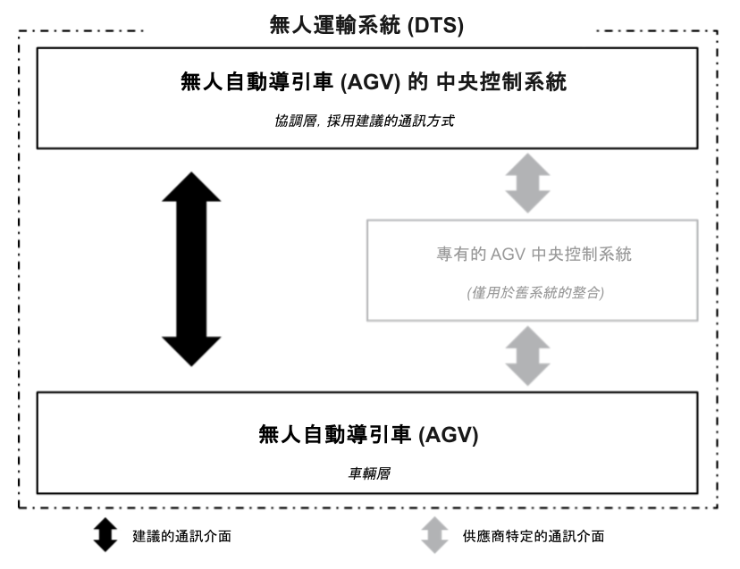
>圖 1：DTS 庫存系統的整合

為了實現上述目標，本標準描述了一個 AGV 與中央控制系統之間的通訊介面，用於任務與狀態資訊傳遞。

然而，其他在 AGV 與中央控制系統之間運行所需的介面（例如，在路徑規劃方面考量特殊能力等），或與其他系統元件（例如，外部週邊設備、防火門等）進行通訊的介面，目前尚未納入本標準。


# 3 適用範圍

本標準提供關於自動導引車（AGV）與中央控制系統之間通訊的定義與最佳實踐。
其目標是讓具有不同特性的 AGV（例如下穿式牽引車或堆高機 AGV）能夠以統一的通訊語言與中央控制系統進行溝通。這將為 AGV 的混合運行提供基礎，使不同類型的 AGV 能夠在同一中央控制系統下協同作業。
中央控制系統負責下達任務並協調 AGV 交通流量。

此通訊介面基於汽車產業中生產與工廠物流的需求。
根據既定的需求，內部物流（intralogistics）的要求涵蓋了整體物流部門的需求，
即從貨物入庫、生產供應到貨物出庫的物流過程，並透過控制自由導航車輛與導引車輛來實現。

與自動駕駛車輛不同，自主車輛能夠基於相對應的感測系統與演算法自行解決問題，
並能夠獨立應對動態環境的變化，或在短時間內適應變化。
自主特性，例如獨立避開障礙物，自由導航車輛或導引車輛皆可實現。
然而，一旦路徑規劃是由車輛本身執行，本標準將其歸類為自由導航車輛（詳見詞彙表）。
自主系統並非完全去中心化（如群體智能），而是透過預定義規則來確保特定行為。

為確保解決方案可持續發展，以下所描述的通訊介面其結構具有可擴展性，
以便完整涵蓋導引車輛的中央控制機制。
此外，自由導航車輛亦可整合至此架構，
但其詳細規格不屬於本標準所建議的範疇。

針對專有庫存管理系統的整合，可能需要額外的介面定義，
這部分不在本標準所建議的範疇。


## 3.1 其他適用文件

文件 | 版本 | 描述
---|---|---
VDI Guideline 2510 | 2005 年 10 月 | 無人搬運系統（DTS）
VDI Guideline 4451 Sheet 7 | 2005 年 10 月 |無人搬運系統（DTS）的相容性 - DTS 中央控制系統
DIN EN ISO 3691-4 | 2023 年 12 月 | 產業用車輛安全要求與驗證 - 第 4 部分：無人搬運車及其系統
LIF – Layout Interchange Format| 2024 年 3 月 | 定義軌道路線格式，以供無人搬運車輛的整合商與（第三方）主控系統之間交換使用

# 4 要求與通訊協議定義

通訊介面設計旨在支援以下要求:

- 控制至少 1000 輛車輛
- 能整合具有不同自主程度的車輛
- 能夠做出決策， 例如路線選擇或交叉路口的行為判斷

車輛應定期或在狀態改變時回傳其狀態。

通訊透過無線網路進行，並考量連線中斷和訊息遺失的影響。

訊息協定採用訊息佇列遙測傳輸（Message Queuing Telemetry Transport，MQTT），並搭配 JSON 結構使用。 本標準在開發過程中經過 MQTT 3.1.1 版本測試，該版本為相容性要求的最低標準。 MQTT 允許將訊息分發至稱為「主題（topics）」的子頻道，MQTT 網路中的參與者可訂閱這些主題，並接收相關或感興趣的資訊。

JSON 結構允許未來以額外參數擴充協定。參數採用英文描述，以確保協定在德語地區以外也能讀取、理解和應用。

# 5 通訊流程與內容

AGV 的運作至少涉及以下參與方:

- AGV 系統的操作員提供基本資訊
- 中央控制系統負責組織與管理 AGV 的運作
- AGV 執行指令

圖 2 說明應用階段的通訊內容。在導入或修改期間，AGV 與中央控制系統需要手動設定。

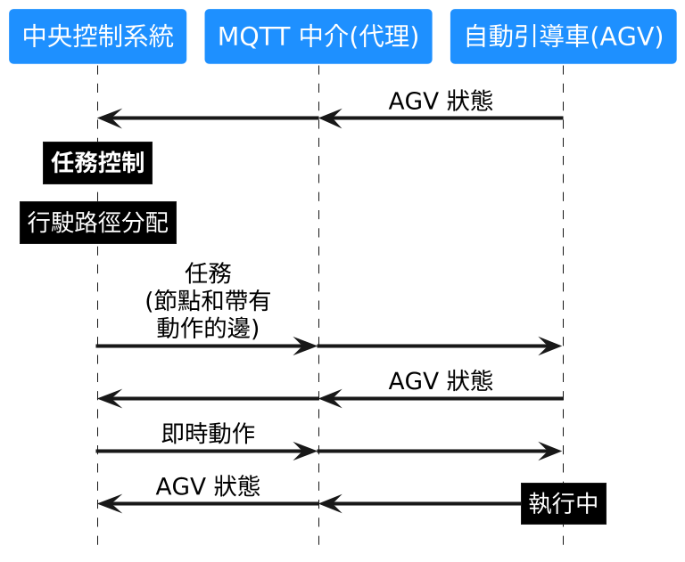
>圖 2：資訊流架構

在應用階段，無人搬運系統（DTS），即中央控制系統與 AGV，將進行設置。操作員負責定義必要的框架條件，並透過手動輸入或從其他系統匯入資料至中央控制系統，以建立所需資訊。這些資訊主要包括以下內容：

- 路徑定義: 可透過 CAD 匯入方式將路徑匯入至中央控制系統，或由操作員在中央控制系統內手動設置。路徑可包含單行道、特定車輛群組的限制通行（基於尺寸比例）等條件。
- 路徑網路組態: 在路徑內定義各種站點，如裝卸站、充電站、周邊環境（如門、電梯、柵欄）、等待區、緩衝區等。
- 車輛組態：操作員需登錄 AGV 的物理屬性（如尺寸、可用貨物載體等）。AGV 應透過 "Factsheet" 主題，以本文件 [6.15 Factsheet](#615-topic-factsheet) 章節所定義的特定格式來傳遞這些資訊。


路線與路網的組態並不包含在本文件範圍內。
這些內容構成了中央控制系統執行指令管理與行駛路徑指派的基礎，系統將依據這些資訊與運輸需求進行調度。
中央控制系統會透過 MQTT 訊息代理（Message Broker），將產生的任務傳送至 AGV，並在任務執行期間持續接收 AGV 回報的即時狀態，這些通訊同樣是透過 MQTT 訊息代理完成的。

中央控制系統的功能

- 分派指令給 AGV
- AGV 的行駛路徑規劃與引導(考量各 AGV 的物理限制，例如尺寸、機動性等)
- 偵測與解決阻塞(死鎖)的問題
- 能源(電能)管理系統: 充電任務可優先於運輸任務執行
- 交通管制: 管理緩衝路線與等待位置，確保運行順暢。
- 能因應(暫時的)環境變化，例如釋放特定區域、調整最大行駛速度等 
- 處理與周邊設備的通訊，例如門、閘門、電梯等
- 偵測與處理通訊錯誤

AGV 的功能:

- 自身定位
- 沿著相關路徑導航 (固定軌道導引或自主導航)
- 執行動作
- 持續回報車輛狀態

此外，系統整合時應考慮以下的要點(非完整列表):

- 地圖組態: 中央控制系統與 AGV 之間的座標系統需保持一致。
- 樞軸點: AGV 在不同狀況下可能有不同的樞軸點（如車輛中心、負載時的重心等），這將影響其行駛路徑與動態輪廓。例如，AGV 載貨與空載時的參考點可能不同，因此導航計算時需考量不同的樞軸點。

# 6 協定規格

本節描述了通訊協定的詳細內容。
該協定規範了中央控制系統與自動導引車（AGV）之間的通信方式。
AGV 與周邊設備（例如 AGV 與閘門之間）的通訊不在此規範範圍內。

不同類型的訊息將以表格的形式呈現，描述作為指令、狀態等發送的 JSON 內容字段。

此外，JSON 結構（schemas）可在公共 Git 儲存庫([GitHub VDA5050](https://github.com/VDA5050/VDA5050))中取得並用於驗證。
每次 VDA5050 發布新版本時，JSON 結構都會更新。
如果 JSON 結構與本文件內容存在差異，以本文件為準。


## 6.1 表格中的符號與格式意義

表格包含標識符的名稱、單位、資料型別，以及描述（如果有的話）。

標識符 | 描述
---|---
標準 | 變數為基本資料型別
**粗體** | 變數為非基本資料型別（如 JSON 物件或陣列），並在其他部分單獨定義
*斜體* | 變數為可選的
***斜體且粗替***| 變數為可選且非基本資料型別
陣列名稱[陣列數據類型] | 變量（此處為陣列名）是方括號內數據類型（此處為陣列數據類型）的陣列

所有關鍵字都區分大小寫。
所有欄位名稱均使用駝峰式命名法（camelCase）。
所有枚舉均使用大寫字母且不含下劃線。


### 6.1.1 可選欄位

如果變數被標記為可選（optional），表示該欄位對傳送方而言是可選的，因為在某些情況下該變數可能不適用。例如，當中央控制系統（Master Control）向 AGV 發送指令時，有些 AGV 會自行規劃行駛軌跡，因此可省略指令中的 `edge` 物件內的 `trajectory` 欄位。

如果 AGV 接收到的訊息包含本協定中標記為選填的欄位，則 AGV 須依據該欄位執行相應的行動，不能忽略該欄位。
若 AGV 無法正確處理該訊息，則應透過錯誤訊息（error message）回報，並拒絕執行該指令。

中央控制系統應僅發送 AGV 能夠支援的可選欄位資訊。

例如: 
Example: 軌跡（trajectory）為可選欄位。
若 AGV 無法處理軌跡資訊，則中央控制系統不應向該 AGV 發送軌跡數據。

AGV 應透過 `factsheet` 訊息回報其所需的選填參數。

### 6.1.2 允許的字元與欄位長度

所有通訊皆使用 UTF-8 編碼，以支援國際化描述。
建議 ID 僅使用以下字元：

A-Z a-z 0-9 _ - . :

最大訊息長度未明確定義，但受限於 MQTT 協議規範，也可能由 factsheet（設備資訊表） 所定義的技術限制。
若 AGV 的記憶體不足 無法處理接收到的指令，則應拒絕該指令。
最大欄位長度、字串長度或數值範圍的對應設定由 系統整合商決定。
為了方便整合，AGV 供應商 應提供詳細的 AGV 資訊表（詳見 [資料表 章節](#616-topic-factsheet)）


### 6.1.3 欄位、主題與枚舉的標記方式

本文件中的主題與欄位以以下格式標示：
`exampleFied`、`exampleTopic`

枚舉需使用 全大寫，並以單引號（' '） 包覆。
例如 `actionStatus` 欄位的可能值包括 `'WAITING'`、`'FINISHED'` 等。

### 6.1.4 JSON 資料型態

應使用 JSON 原生的資料型別。
因此，布林值應以 "true" 或 "false" 表示，而不應該使用枚舉（如 'TRUE'、'FALSE'）或魔術數字（magic numbers）。

數值型態需具體說明類型與精度，例如：float64 或 uint32。
不支援 IEEE 754 規範的特殊數值，如 NaN（非數值） 或 無窮大（Infinity）。


## 6.2 MQTT 連線處理、安全性與 QoS

MQTT 協定提供用戶端設置遺囑消息（will message）的選項。
若客戶端（Client）因任何原因意外斷線，MQTT 代理（Broker）會將該遺囑消息傳送給所有已訂閱的客戶端。
此功能的詳細使用方式請參見 [6.14 Topic "connection"](#614-topic-connection).

當 AGV 與代理斷線時，仍會保留所有 任務資訊，並執行至最後一個已釋放的節點（Node）。

MQTT 代理的配置應確保協定安全性。

為減少通訊負擔, t以下主題應使用 QoS 等級 0 (Best Effort) `order`, `instantActions`, `state`, `factsheet` and `visualization`.
而 `connection` 主題則應使用 QoS 等級 1（至少 1）。


## 6.3 MQTT 主題層級

由於雲端供應商的強制主題結構，MQTT 主題結構並未嚴格規範。
若使用 雲端型 MQTT 代理（Cloud-based Broker），需根據供應商需求調整主題層級，但仍必須符合本協定所定義的主題名稱。這意味著以下各節中定義的主題名稱是強制性的。

若使用 本地 MQTT 代理，建議採用以下主題格式:

**interfaceName/majorVersion/manufacturer/serialNumber/topic**

範例:
```
uagv/v2/KIT/0001/order
```


MQTT 主題層級 | 資料型態 | 描述
---|---|---
interfaceName | string | 使用的介面名稱
majorVersion | string | VDA 5050 建議版本號，前綴需加上 "v"
manufacturer | string | AGV 製造商名稱
serialNumber | string | AGV 唯一序號，允許以下字元: <br>A-Z <br>a-z <br>0-9 <br>_ <br>. <br>: <br>-
topic | string | 主題名稱（如 `order` 或 `state`，參見 [6.5 通訊主題](#65-topics-for-communication)

注意: 由於 `/` 字元用於定義主題層級，因此不得用於任何欄位。`$` 字元在某些 MQTT 代理中具有特殊用途（例如內部系統主題），因此不應使用。

## 6.4 協定標頭

每個 JSON 訊息都以標頭（header）開頭。
在後續章節中，這些欄位將統稱為標頭，以提高可讀性。
標頭本身不是一個 JSON 物件，而是由以下元素組成:

物件 結構/標識符 | 資料型態 | 描述
---|---|---
headerId | uint32 | 訊息的標頭 ID。<br> headerId 針對每個主題獨立定義，並在每次發送（但不一定接收到）訊息時遞增 1。
timestamp | string | 時間戳記（ISO 8601, UTC）；格式為 YYYY-MM-DDTHH:mm:ss.ffZ（例如："2017-04-15T11:40:03.12Z"）。
version | string | 協定的版本，格式為 [主版本].[次版本].[修正版本]（例如：1.3.2）。
manufacturer | string | AGV 的製造商名稱。
serialNumber | string | AGV 的序號。


### 協定版本

該協定版本遵循語義化版本控制。  

主要版本（Major）變更範例:
- 破壞性變更，例如新增非選擇性（強制性）欄位。  

次要版本（Minor）變更範例:
- 新增功能，例如新增傳遞視覺化資料的主題。

修正版本（Patch）變更範例:
- 提高電池電量的精度顯示。


## 6.5 通訊主題

AGV 通訊協定使用以下主題來實現中央控制系統與 AGV 之間的資訊交換

主題名稱 | 發布者 | 訂閱者 | 用途 | 實作要求 | 結構
---|---|---|---|---|---
order | 中央控制系統  | AGV | 傳遞AGV的行駛指令 | 必須 | order.schema
instantActions | 中央控制系統  | AGV | 傳遞需要立即執行的動作 | 必須 | instantActions.schema
state | AGV | 中央控制系統 | 傳遞AGV的狀態 | 必須 | state.schema
visualization | AGV | 視覺化系統 | 為了視覺化呈現，AGV透過主題以高頻率回傳位置 | 可選 | visualization.schema
connection | MQTT代理/AGV | 中央控制系統 | 當 AGV 連線中斷時發送通知（不可用於健康檢查） | 必須 | connection.schema 
factsheet | AGV | 中央控制系統 | 提供 AGV 設定參數及製造商資訊，以協助中央控制系統設定 | 必須 | factsheet.schema

## 6.6 主題: 「order」 (從中央控制系統到 AGV)

「order」主題是透過 MQTT 傳輸的主題，AGV 會透過該主題接收以 JSON 格式封裝的指令。

### 6.6.1 概念與邏輯

任務的基本結構是一個由節點（nodes）與邊（edges）組成的圖形。
預期無人搬運車（AGV）將依照圖形中所定義的節點與邊進行行駛，以完成該任務。
所有已連接的節點與邊所構成的完整圖形，保留在中央控制系統。

中央控制系統內部的圖形表示方式包含一些限制條件，例如：特定 AGV 允許行駛的邊。
這些限制條件不會傳送給 AGV；中央控制系統傳遞給 AGV 的任務中僅包含該 AGV 可行駛的邊。

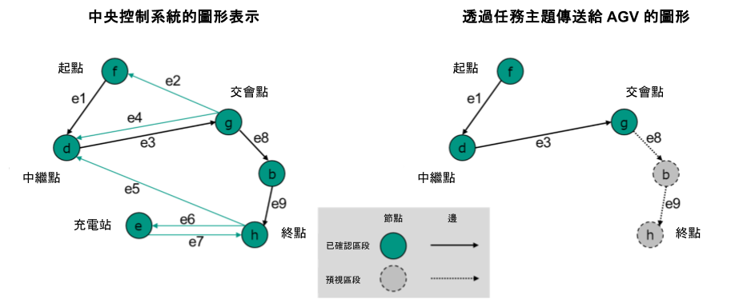
>圖 3 中央控制系統中的資料以圖形示意與傳輸(給AGV)的任務資料以圖形示意

在任務訊息中，節點與邊會以兩個獨立的清單傳送。
清單中節點與邊的排列順序即決定了 AGV 行駛時所應遵循的順序。

為了確保任務有效，任務中至少須包含一個節點，且邊的數量應等於節點數量減一。

任務中的第一個節點應讓 AGV 可直接抵達，意即 AGV 已停在該節點上，或是位於該節點的容許的偏差範圍內。

節點與邊皆具有布林屬性 `released`(已釋放).
若節點或邊的`released` 為 `true` 代表已釋放，則 AGV 預期將行駛該節點或邊；
反之若為 `false` 代表未釋放，則 AGV 不應行駛該節點或邊。

只有當邊的起點與終點節點皆已釋放時，該邊才能被釋放。
 
一旦出現未釋放的邊，後續序列中不得出現已釋放的節點或邊。

已釋放的節點與邊的集合稱為「base」(已確認區段)；
未釋放的節點與邊的集合稱為「horizon」(預視區段)。

任務訊息可以不包含預視區段。

任務訊息不一定描述完整的運輸任務。
為了實現交通管制並因應資源受限的車輛，完整的運輸任務（可能包含多個節點與邊）可拆分成多個子任務，
而這些子任務之間則透過 `orderId` 與 `orderUpdateId` 欄位來進行連結。
下一節將介紹更新任務的流程。

### 6.6.2 任務與任務更新

為了支援交通管理，中央控制系統可以將傳輸給車輛的任務路徑拆分為兩個部分：

- *"已確認區段 (Base)"*: 這是允許 AGV 行駛的已定義路徑。已確認區段路線的所有節點和邊都已經被中央控制系統釋出給該車輛。已確認區段的最後一個節點稱為決策點。
- *"預視區段(Horizon)"*: 這是中央控制系統當前規劃給 AGV、預計在決策點後行駛的路徑。
預視區段內的路徑尚未由中央控制系統釋放。

如果已確認區段未擴展，AGV 在抵達決策點時應停止。 為確保 AGV 可順暢行駛，若交通狀況允許，中央控制系統應在 AGV 抵達決策點前擴展已確認區段。

由於 MQTT 為非同步通訊協議，且無線網路傳輸並不穩定，因此已確認區段的內容一旦傳輸後便不可更改。 中央控制系統應假設 AGV 已執行已確認區段內的任務。儘管後續章節將說明取消任務的流程，但由於上述通訊限制，取消指令的可靠性亦受影響。

中央控制系統可以向 AGV 傳送更新後的路徑（包含修改後的節點與邊）來變更預視區段。
變更預視區段的流程如圖 4 所示。

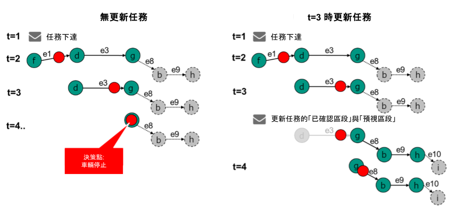
>圖 4 變更「預視區段」路徑的步驟

在 圖 4 中，中央控制系統在 t = 1 時首先發送了一個初始任務。
圖 5 顯示了可能的任務之偽代碼（pseudocode）。
為了保持可讀性，此處省略了完整的 JSON 範例。

```
{
	orderId: "1234"
	orderUpdateId:0,
	nodes: [
	 	 f {released: True},
	 	 d {released: True},
	 	 g {released: True},
	 	 b {released: False},
	 	 h {released: False}
	],
	edges: [
		e1 {released: True},
		e3 {released: True},
		e8 {released: False},
		e9 {released: False}
	]
}
```
>圖 5 任務的偽代碼


在 t = 3 時，透過發送任務擴展來更新任務（請參閱 圖 6 的範例）。
請注意 `orderUpdateId`（任務更新 ID）已遞增，任務更新後的第一個節點對應於前一個任務訊息中最後一個已確認區段的節點。

這樣可以確保 AGV 能夠順利執行任務更新，也就是說：
任務更新後的第一個節點必須能夠透過 AGV 已知的邊（edges）抵達。

```
{
	orderId: 1234,
	orderUpdateId: 1,
	nodes: [
		g {released: True},
		b {released: True},
		h {released: True},
		i {released: False}
	],
	edges: [
		e8 {released: True},
		e9 {released: True},
		e10 {released: False}
	]
}
```
>圖 6 任務的偽代碼，請注意 `orderUpdateId` 的變更

此機制有助於應對更新任務的訊息丟失的情況 (例如: 無線網路不穩定)。
AGV 可以總是檢查最後的「已確認區段」節點的 `nodeId`（及 `nodeSequenceId`，此部分後續將詳細說明）是否與新的「已確認區段」第一個節點相同。

此外請注意到節點 g 是唯一再次發送的「已確認區段」節點。由於「已確認區段」無法變更，因此無法重新傳輸節點 f 和 d。

重要的是，拼接節點（stitching node，範例中的節點 g）的內容不得變更。
AGV 應使用最初的任務（圖 5，orderUpdateId = 0）中的動作(actions)、偏差範圍(deviation range)...等指示來執行。

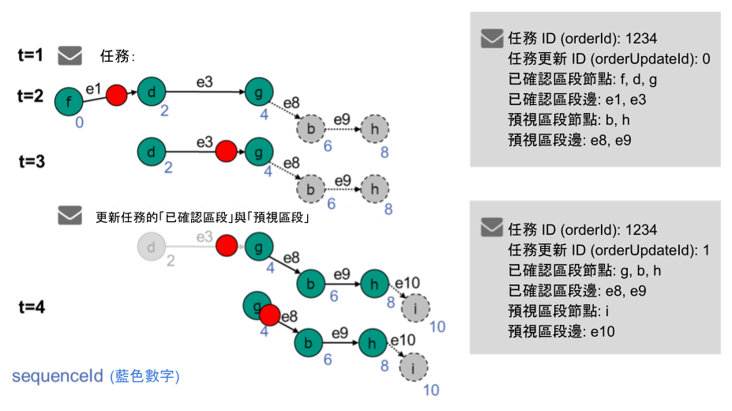
>圖 7 任務擴展的標準更新流程

圖 7 說明了任務如何進行擴展，並顯示 AGV 當前可獲得的資訊。
任務擴展時，`orderId`（任務 ID）保持不變。 `orderUpdateId`（任務更新 ID）遞增。

更新的任務中，上一個「已確認區段」的最後一個節點，將作為新任務中「已確認區段」的第一個節點。
AGV 可透過此節點將新的任務與現有任務拼接（stitching）。
先前「已確認區段」中的其他節點與邊不會被重新傳輸。

中央控制系統可以選擇發送完全不同的節點作為新的「已確認區段」。
也可以刪除「預視區段」，讓 AGV 僅執行目前的「已確認區段」。

為了允許任務有循環路徑（例如：從節點 a 到 b，再回到 a），需要為節點與邊分配 `sequenceId`（序列 ID）。`sequenceId` 貫穿所有節點與邊。（任務的第一個節點為 0，第一條邊為 1，第二個節點為 2，依此類推）。 這樣有助於追蹤任務進度。

一旦 `sequenceId` 被分配，後續任務更新時不得變更（請參閱 圖 7）。
確保 AGV 能夠識別中央控制系統所指的節點，這是必須的。

圖 8 描述了 AGV 接受任務或任務更新的流程。

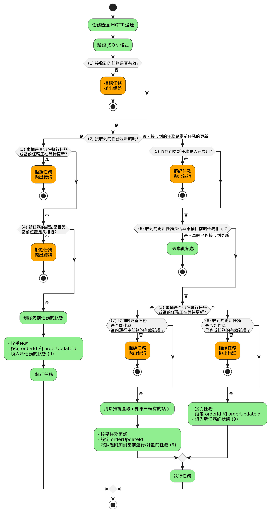
>圖 8 接受任務或任務更新的流程

1)	**接收到的任務是否有效？**:  
檢查所有格式與 JSON 數據類型是否皆正確?

2)	**收到的任務是新的，還是目前執行中任務的更新？**:  
`orderId` 是否與車輛當前持有的 `orderId` 不同？

3)	**車輛是否仍在執行任務，或當前任務正在等待更新？**:  
`nodeStates` 是否非空值？ 或 `actionStates` 是否包含非狀態 'FAILED' (失敗) 與 'FINISHED' (完成) 的動作？ 預視區段中的節點、邊，以及這些元素對應的動作狀態，也都會被包含在車輛當前的狀態。任務的預視區段也包含在狀態中，因此車輛可能仍在等待更新，並同時執行當前任務。

4) **新的任務起點是否與當前位置足夠接近？**:  
車輛是否已經停在該節點上，或位於該節點的允許偏移範圍內（請參考 [6.6.1 概念與邏輯](#661-概念與邏輯)）？

5) **收到的更新任務是否已棄用？**:  
`orderUpdateId` 是否比車輛目前持有的 `orderUpdateId` 小？

6)	**收到的更新任務是否與車輛目前的任務相同？**:  
`orderUpdateId` 是否比車輛目前持有的 `orderUpdateId` 相等？

7)	**收到的更新任務是否能作為當前運行中任務的有效延續？**:  
收到的更新任務的第一個節點是否與當前決策點（已確認區段的最後一個節點） 相同？
若車輛仍在執行先前已釋出的已確認區段或仍有預視區段等待更新，則只有當新已確認區段的第一個節點等於前一個已確認區段的最後一個節點時，該任務更新才會被接受。

8)	**收到的更新任務是否能作為已完成任務的有效延續？**:   
新任務更新的 第一個節點的 `nodeId` 和 `sequenceId` 是否等於車輛的 `lastNodeId` 和 `lastNodeSequenceId`？
若車輛已經完成已確認區段內的所有動作，且不再等待預視區段的更新，則新已確認區段的第一個節點必須匹配車輛最後遍歷的節點(`lastNodeId`與`lastNodeSequenceId`皆要相等)，任務更新才會被接受。

9)	填充/附加狀態數據至 `actionStates`/`nodeStates`/`edgeStates`來記錄目前的狀態變化。

### 6.6.3 任務取消 (由中央控制系統執行)

當已確認區段的節點發生未預期變更時，應使用 instantAction `cancelOrder` 來取消當前任務。

收到 `cancelOrder` 指令後，AGV 會停止移動（具體停在哪裡取決於其能力，例如原地停止或移動到下一個節點）。

若有排程中的動作，則這些動作應被取消，並在 `actionState` 中回報 'FAILED'。
若有正在執行的動作，則這些動作也應被取消，並在 `actionState` 中回報 'FAILED'。
若某些動作無法被中斷，則這些動作的 `actionState` 應繼續顯示 'RUNNING'，直到動作結束：
如果動作成功完成，則狀態變為 'FINISHED'。
如果動作失敗，則狀態變為 'FAILED'。
當動作仍在執行時，`cancelOrder` 的動作狀態應顯示 'RUNNING'，直到所有動作都被取消或完成。
當 AGV 的所有動作與移動都停止後，cancelOrder 的動作狀態應回報 'FINISHED'。

`orderId` 和 `orderUpdateId` 維持不變。

圖 9 顯示了不同類型 AGV 在接收到 cancelOrder 指令後的預期行為。

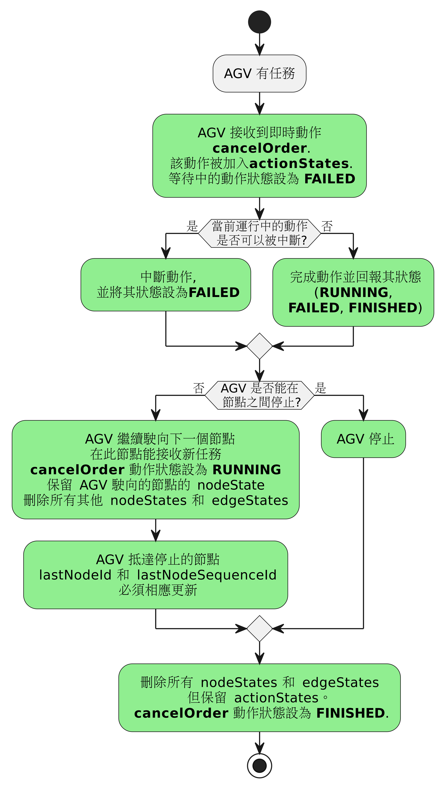
>圖 9 收到 `cancelOrder` 指令後的預期行為

#### 6.6.3.1 取消後接收新任務

當前任務被取消後，AGV 應在能夠接收新任務的狀態。

若 AGV 透過標籤（Tag）進行節點定位，新的任務起始節點必須是 AGV 當前所在的節點（詳見圖 5）。  
若 AGV 可以停在節點之間（自由定位），則中央控制系統可以選擇如何開始新的任務。  
AGV 應該要都能接受這兩種方法。

實踐方式有兩種選項:

方式 1：新的任務以 AGV 當前位置作為臨時節點，AGV 檢測到該節點可輕鬆到達後而接受任務。
方式 2：新的任務起始節點設定為上一個已通過的節點，但將該節點的**偏移範圍（Deviation Range）**設為足夠大，使 AGV 位於該範圍內，從而判定該節點已通過並接受任務。

#### 6.6.3.2 當 AGV 無任務時收到 cancelOrder

如果 AGV 當前沒有執行中的任務，或是先前的任務已被取消，則收到 `cancelOrder` 指令時應在 `cancelOrder` 動作狀態中回報 'FAILED'。

AGV 回傳 "noOrderToCancel" 錯誤，並將 `errorLevel` 設為 'WARNING'。

在錯誤回報中，將該 `instantAction` 的 `actionId` 設為 `errorReference`，以便中央控制系統追蹤此錯誤。

### 6.6.4 任務拒絕

有幾種情境會導致 AGV 拒絕任務。  
這些情境如 圖 8 所示，並在以下進行說明。


#### 6.6.4.1 車輛收到格式錯誤的新任務

解決方案:

1. 車輛不會將該任務存入內部緩衝區。
2. 車輛回報警告 "validationError"
3. 車輛會持續回報該警告直到成功接受新的任務。


#### 6.6.4.2 車輛收到包含無法執行的動作或無法使用的欄位的任務

舉例:

- 無法執行的動作: 要求的舉升高度超過 AGV 最大舉升高度、要求執行舉升動作，但 AGV 沒有舉升裝置...等。
- (車輛)無法使用的欄位: 軌跡（trajectory）資訊...等。

解決方案:

1. 車輛不會將該任務存入內部緩衝區。
2. AGV 回報警告 "orderError"，並將錯誤的欄位回報，以作為錯誤參考。
3. 車輛會持續回報該警告直到成功接受新的任務。


#### 6.6.4.3 車輛收到相同 orderId，但 orderUpdateId 低於當前的 orderUpdateId 的新任務

解決方案:

1. 車輛不會將該任務存入內部緩衝區。
2. 車輛會在緩衝區內保留先前的任務，不會更新。
3. 車輛回報警告 "orderUpdateError"
4. 車輛繼續執行先前的任務。

若車輛收到相同的 `orderId` 和 `orderUpdateId` 兩次，則第二次收到的任務將被忽略。
這可能發生在中央控制系統未及時接收到 AGV 的狀態回報，導致系統重發任務，但實際上 AGV 已經接收過該任務了。

### 6.6.5 走廊

可選的邊屬性 `corridor` （走廊）允許車輛在避開障礙物時偏離預設軌跡，並定義允許車輛運行的範圍。
要使用 `corridor` 屬性，必須先定義一條預設軌跡，該軌跡是在沒有 `corridor` 限制時，車輛所應遵循的路徑。這條預設軌跡可以是車輛內建並由中央控制系統已知的軌跡，也可以是任務指令中提供的軌跡。
使用 `corridor` 屬性的車輛仍然遵循線導引（line-guided）模式行駛，但允許在短暫偏離軌跡以避開障礙物後，再返回預設路徑。

*備註:
在任務指令中，邊僅表示兩個節點之間的邏輯連接，而不一定是車輛行駛的真實軌跡。
具體而言，車輛在起始節點與目標節點之間的行駛軌跡，可能是中央控制系統透過`trajectory`(軌跡)邊屬性定義的，或者由車輛內部預設的行駛軌跡決定。
此外，根據車輛的內部狀態，所選擇的行駛軌跡可能會有所不同。*

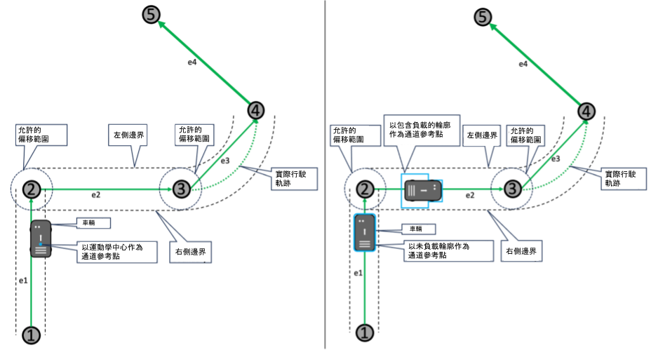
>圖 10 具有 `corridor` 屬性的邊，其定義了車輛可偏離預設軌跡以避障的左右邊界。在左圖中，車輛的運動中心（kinematic center）決定了允許的偏移範圍，而在右圖中，車輛的輪廓（可能包括所載貨物）決定了允許的偏移範圍。這一設定由 `corridorRefPoint` 參數決定。


車輛可獨立導航的範圍（即允許偏離原始邊緣軌跡的區域）由左、右邊界定義。
可選的 `corridorRefPoint` 欄位用於指定該偏移限制應基於車輛的運動控制點（control point）還是車輛的整體輪廓（包括貨物）。
當車輛通過某個節點時，應確保車輛始終處於新的當前邊界範圍內。
若不允許車輛偏離軌跡，則中央控制系統應直接省略 `corridor` 欄位，而不是將其設為零。

車輛的運動控制軟體應持續檢查車輛是否在定義的邊界內行駛。
若車輛偏離允許的導航範圍，則應立即停止並報告錯誤。
中央控制系統可以決定是否需要人員介入處理，或者透過取消當前任務並發送新的包含走廊資訊的任務，使車輛重新獲得移動許可。

*備註: 允許車輛偏離軌跡將增加行駛過程中的可能占用空間（footprint）。這一點應在系統初始運行時考慮，並在中央控制系統基於車輛占用空間進行交通控制決策時加以考量。*

更多資訊請參閱 [6.10.2 Traversal of nodes and entering/leaving edges](#6102-traversal-of-nodes-and-enteringleaving-edges-triggering-of-actions) 

## 6.6.6 任務訊息的實作

物件結構 | 單位 | 資料型態 | 描述
---|---|---|---
headerId | | uint32 | 訊息的標頭 ID。<br> 每個主題的標頭 ID 都會被定義，且每發送一次訊息（但不一定被收到）就會遞增 1。
timestamp | | string | 時間戳記（ISO 8601，UTC）；格式：YYYY-MM-DDTHH:mm:ss.ffZ（例如："2017-04-15T11:40:03.12Z"）。
version | | string | 通訊協議的版本 [主版].[次版].[修訂]（例如：1.3.2）。
manufacturer | | string | AGV 的製造商。
serialNumber | | string | AGV 的序號。
orderId | | string | 任務識別碼。 <br> 用於識別屬於相同任務的多個任務訊息。
orderUpdateId | | uint32 | 任務更新識別碼。<br>每個 orderId 為唯一。<br>如果任務更新被拒絕，此欄位應包含在拒絕訊息中。
*zoneSetId* | | string | 區域集合的唯一識別碼，用於導引 AGV 或讓中央控制系統做相關的(任務)規劃。 <br> <br> 可選填欄位：某些中央控制系統不使用區域，某些 AGV 無法解析區域資訊。若不使用區域，請勿在訊息中添加此欄位。
**nodes [node]** | | array | 執行任務所需經過的的節點陣列。 <br>至少包含一個節點即可構成有效任務。 <br>在此情況下，邊陣列應保持空值。
**edges [edge]** | | array | 執行任務所需經過的的邊陣列。 <br>至少包含一個節點即可構成有效任務。 <br>在此情況下，邊陣列應保持空值。

物件結構 | 單位 | 資料型態 | 描述
---|---|---|---
**node** { | | JSON object|
nodeId | | string | 節點的唯一識別碼。
sequenceId | | uint32 | 用於追蹤任務中節點與邊緣的順序，以便簡化訂單更新。 <br>其主要目的是在相同 orderId 中區分重複經過的節點。 <br>sequenceId 橫跨同一個訂單的所有節點與邊緣，並在新的 orderId 發布時重置。
*nodeDescription* | | string | 節點的額外資訊。
released | | boolean | "true" 表示該節點為已確認區段（base）的一部分。 <br> "false" 表示該節點屬於預視區域（horizon）的一部分。
***nodePosition*** | | JSON object | 節點的位置。 <br> 對於不需要節點位置的車輛類型（例如：循線導航車），此欄位為選填。
**actions [action]** <br> } | | array | 在該節點執行的動作陣列。 <br> 若無需執行動作，則保持空白陣列。

物件結構 | 單位 | 資料型態 | 描述
---| --- |--- | ---
**nodePosition** { | | JSON object | 在專案特定的世界座標系統中定義的地圖位置。 <br>每個樓層都有自己的地圖。 <br>所有地圖應使用相同的專案特定全域原點。
x | m | float64 | 相對於地圖座標系統的 X 位置。 <br>精度取決於具體實作。
y | m | float64 | 相對於地圖座標系統的 Y 位置。 <br>精度取決於具體實作。
*theta* | rad | float64 | 範圍: [-Pi ... Pi] <br><br>AGV 在該節點的絕對方向。<br> 若車輛可自行規劃路徑，此欄位為選填。<br>若有定義，AGV 必須在該節點採用指定的 θ 角度。<br>如果前一個邊不允許旋轉，則 AGV 應在節點上旋轉。<br>如果下一個邊要求(與節點)不同的方向但不允許旋轉，則 AGV 必須在進入該邊之前，在節點上旋轉至該邊的指定朝向。
*allowedDeviationXY* | m | float64 | 用於表示 AGV 需要多精確地對齊節點位置，才能視為已通過該節點。 <br><br> 若該值等於 0.0，表示不允許偏差（無偏差指的是符合 AGV 製造商的標準容許範圍）。 <br><br> 若該值大於 0.0，表示允許的偏差半徑（單位：公尺）。 <br>如果 AGV 通過節點時在此偏差半徑內，則視為已通過該節點。
*allowedDeviationTheta* | rad | float64 | 範圍: [0.0 ... Pi] <br><br> 用於表示 AGV 在節點上需要多精確地符合 θ 角度。 <br>可接受的最小角度為 θ - allowedDeviationTheta，最大角度為 θ + allowedDeviationTheta。
mapId | | string | 參照該位置的地圖唯一識別碼。 <br> 特定專案中的每張地圖的座標具有相同的全域原點。 <br>當 AGV 使用電梯時，例如從出發樓層前往目標樓層，它會從出發樓層的地圖上消失，並出現在目標樓層地圖中的對應電梯節點上。
*mapDescription* <br> } | | string | 關於該地圖的額外資訊。

物件結構 | 單位 | 資料型態 | 描述
---|---|---|---
**action** { | | JSON object | 描述 AGV 可執行的動作。
actionType | | string | 動作的名稱，參見「動作與參數」表的第一欄。 <br> 用於辨識是何種動作。
actionId | | string | 該動作的唯一ID，用於對應到狀態中的 actionState。 <br>建議使用 UUID。 
*actionDescription* | | string | 關於動作的附加資訊。
blockingType | | string | 枚舉值 {'NONE', 'SOFT', 'HARD'}: <br> 'NONE': 允許行駛及其他動作;<br>'SOFT': 允許執行其他動作，但不允許行駛;<br>'HARD': 此時僅允許執行該動作，其他動作皆不可執行。
***actionParameters [actionParameter]*** <br><br> } | | array | 指定動作的 actionParameter 物件陣列，例如 "deviceId"、"loadId"、"external triggers"。 <br><br> 實作範例請參考 [7.2 Format of parameters](#72-format-of-parameters).

物件結構 | 單位 | 資料型態 | 描述
---|---|---|---
**edge** { | | JSON object | 兩個節點之間的有向性連結。
edgeId | | string | 用於識別邊的唯一碼。
sequenceId | | uint32 | 用於追蹤節點與邊的順序，並簡化訂單更新的編號。 <br>sequenceId 依序將相同任務內的所有節點與邊串連，當新的 orderId 發佈時會重置。
*edgeDescription* | | string | 關於邊的附加資訊。
released | | boolean | "true" 表示此邊為已確認區段（base）的一部分。 <br> "false" 表示此邊屬於預視區域（horizon）的一部分。 
startNodeId | | string | 任務內第一個節點的 nodeId。
endNodeId | | string | 任務內最後一個節點的 nodeId。
*maxSpeed* | m/s | float64 | 此邊允許的最大速度。 <br>速度以車輛測量的最快數值為準。
*maxHeight* | m | float64 | 車輛（含負載）在此邊的允許最高高度。
*minHeight* | m | float64 | 負載裝置在此邊允許的最低高度。
*orientation* | rad | float64 | AGV 在此邊的朝向。 `orientationType` 欄位決定該值是相對於專案特定的全域座標系統，還是相對於此邊的切線方向。 當相對於切線方向時，0.0 表示向前行駛，Pi 表示倒車。 <br>例如：orientation = Pi/2 會使 AGV 旋轉 90 度。<br><br>如果 AGV 初始方向不同，且`rotationAllowed` 為 "true"，則可在該邊旋轉至指定方向。 若 `rotationAllowed` 為 "false"，需在進入該邊前完成旋轉。 <br>若無法完成旋轉，則拒絕該訂單。<br><br>若未定義軌跡，則旋轉應應用於該邊兩個節點之間的直線路徑。 若該邊已定義軌跡，則旋轉應應用於該軌跡。
*orientationType* | | string | 枚舉值 {'GLOBAL', 'TANGENTIAL'}：<br>'GLOBAL'：相對於專案特定的全域座標系統；<br>'TANGENTIAL'：相對於此邊的切線方向。<br><br>若未定義，預設值為 'TANGENTIAL'。
*direction* | | string | 設定路口的行駛方向（適用於循線導引車輛），需依車輛特性預先定義。<br> 例如："left"、"right"、"straight"。
*rotationAllowed* | | boolean |  "true"：允許在該邊旋轉。<br>"false"：不允許在該邊旋轉。<br><br>若未設定，則無旋轉限制。
*maxRotationSpeed* | rad/s | float64| 最大旋轉速度。<br><br>若未設定，則無速度限制。
***trajectory*** | | JSON object | 此邊的軌跡（NURBS 形式）。<br>定義 AGV 在此邊應行駛的路徑，從起始節點到終點節點。<br><br>若 AGV 無法處理軌跡，或自行規劃路徑，則可忽略此欄位。
*length* | m | float64 | 從起始節點到終點節點的路徑長度。<br><br>循線導引 AGV 可使用此值，在接近停止點時降低速度。
***corridor*** | | JSON object | 定義車輛可偏離軌跡的範圍，例如用於避障。<br>
**action [action]**<br><br><br> } | | array | 需要在此邊執行的動作陣列。 <br>若無動作需求，則為空陣列。 <br>由該邊觸發的動作僅在 AGV 通過該邊時生效。 <br>當 AGV 離開該邊時，動作將停止並恢復進入該邊前的狀態。


物件結構 | 單位 | 資料型態	 | 描述
---|---|---|---
**trajectory** { | | JSON object |
degree | | float64 | 範圍: [1.0 ... float64.max]<br><br>定義軌跡的 NURBS 曲線的階數。<br><br>若未定義，則預設值為 1。
**knotVector [float64]** | | array | 範圍: [0.0 ... 1.0]<br><br>NURBS 的節點值陣列。<br><br>knotVector 的大小為控制點數量 + 階數 + 1
**controlPoints [controlPoint]**<br><br> } | | array | 控制點物件的陣列，定義 NURBS 的控制點，明確包含起點與終點。

物件結構 | 單位 | 資料型態 | 描述
---|---|---|---
**controlPoint** { | | JSON object |
x | | float64 | 以世界座標系統表示的 X 座標。
y | | float64 | 以世界座標系統表示的 Y 座標。
*weight* | | float64 | 範圍: [0.0 ... float64.max]<br><br> 控制點對曲線的影響權重。<br>若未定義，則預設值為 1.0。
} | | |

物件結構 | 單位 | 資料型態 | 描述
---|---|---|---
***corridor*** { | | JSON object |
leftWidth | m | float64 | 範圍: [0.0 ... float64.max]<br>定義車輛相對於軌跡左側的通道寬度 (公尺)（參見圖 13）
rightWidth | m | float64 | Range: [0.0 ... float64.max]<br>定義車輛相對於軌跡右側的通道寬度 (公尺)（參見圖 13）。
*corridorRefPoint* <br><br>**}**| | string | 定義邊界是針對運動學中心 (kinematic center) 還是車輛輪廓 (contour) 設定。 若未指定，則預設適用於車輛的運動學中心<br> 枚舉值:  { 'KINEMATICCENTER' , 'CONTOUR' }

### 6.7 地圖

為了讓不同品牌、類型的 AGV 導航的一致性，所有的定位都要參考該專案的座標系統（參考圖 11）。
如果場地有不同樓層或區域，會用一個獨立的 `mapId` 來區分。
地圖的座標系統採用 右手座標系，Z 軸朝上。逆時針方向為正旋轉
AGV 本身的座標系統也是右手座標系，X 軸是車輛前進方向，Z 軸朝上。車輛的參考點定義為 (0,0,0)，除非有另外指定。 這與 DIN ISO 8855 標準的 2.11 節 一致。

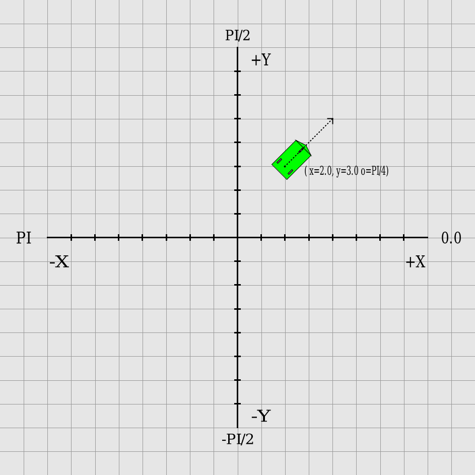
>圖 11 樣本 AGV 與其方向在座標系統上

X、Y、Z 座標的單位是公尺，方向（旋轉角度）用弧度表示，範圍是 -Pi 到 +Pi

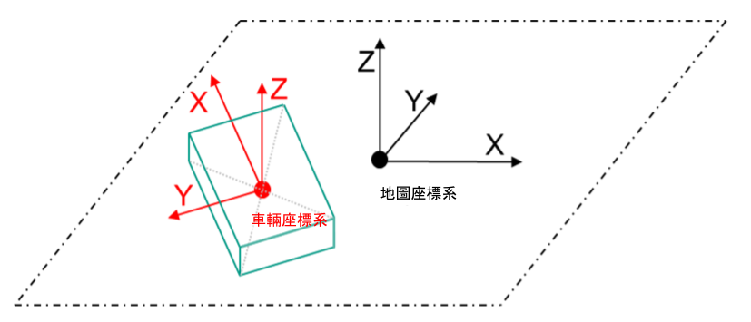
>圖 12 地圖與車輛的座標系統


### 6.7.1 地圖分發

為實現自動地圖分發及車輛重啟時的智慧管理，引入標準化的地圖分發機制。

地圖檔案儲存於專用地圖伺服器，讓 AGV 可以存取。 為確保高效傳輸，每次傳輸應僅包含單一檔案。若需傳輸多張地圖或是文件，應先打包為單一檔案。 地圖下載採用 拉取（pull）機制，由中央控制系統透過 `instantAction` 發送下載指令，觸發 AGV 進行下載。

每張地圖透過地圖ID (`mapId`) 與地圖版本 (`mapVersion`) 這兩個欄位進行唯一識別。
地圖ID對應 AGV 物理作業區域中的特定區域，地圖版本表示先前更新地圖之後的版本。 在接受新任務前，AGV 需確認所有請求的地圖ID是否已存在於本地端。中央控制系統負責確保 AGV 啟用正確地圖。

為減少系統停機時間並確保中央控制系統可以更容易同步啟用新地圖，AGV 必須預先下載或是有緩存地圖。 車輛上地圖的狀態可以透過車輛狀態的頻道存取。 需要注意的是地圖下載與地圖啟用為分別獨立的過程。 為了啟動車輛預先載入的地圖，中央控制系統會發出一個即時操作 (instant action) 來啟用它。在此情況下，相同地圖ID但不同地圖版本的地圖將自動停用。 中央控制系統可以透過另一個即時操作來刪除地圖，刪除的結果將顯示於車輛狀態資訊中。

地圖分發流程請參考 圖13。


>圖 13 中控系統與AGV之間的下載、啟用與刪除地圖之溝通需求時序圖

#### 6.7.2 車輛狀態中的地圖資訊

狀態的 `agvPosition` 中的 `mapId` 代表目前啟用的地圖。有關車輛上可用地圖的資訊在 `maps` 這個陣列中，此陣列為狀態訊息的一部分。 `maps` 這個陣列中的元素皆為 JSON 物件，由 `mapId` 、`mapVersion` 與 `mapStatus` 組成。 其中 `mapStatus` 可為 'ENABLED' 或 'DISABLED'。AGV只能使用 'ENABLED' 狀態的地圖，而 'DISABLED' 狀態的地圖不可使用。 地圖下載時，當前動作的狀態以未完成表示。若發生錯誤也會在狀態中呈現。

注意: 可以同時啟用多個不同 `mapId` 的地圖。 但同一個 `mapId` 的地圖僅能有一個被啟用。若 `maps` 陣列為空，則表示AGV目前沒有可用地圖。


#### 6.7.3 地圖下載

地圖下載由中央控制系統發送即時操作:  `downloadMap` 觸發，該指令包含必要參數 `mapId` 與 `mapDownloadLink`，這些參數可以在存放地圖的伺服器中被車輛存取。

當AGV開始下載地圖檔案時，`actionStatus` 變更為 'RUNNING'。 
若下載成功，`actionStatus` 變更為 'FINISHED'。若下載失敗，`actionStatus` 變更為 'FAILED'。
下載成功完成後，地圖應加入狀態中的 `maps` 陣列。地圖在尚未準備好啟用之前，不應該出現在AGV的狀態回報中。 

重要的是要確保下載地圖的過程中不會修改、刪除、啟用或停用車輛上現有的其他地圖。
車輛應拒絕下載車輛上已有相同 `mapId` 與 `mapVersion` 的地圖。此情況應回報錯誤，並將即時操作的狀態設為 'FAILED'。中央控制系統應該先刪除車輛上的地圖，再重新下載。


#### 6.7.4 啟用下載的地圖

啟用車輛上的地圖的方式有兩種：

1. **由中央控制系統啟用**: 發送即時操作 `enableMap` 將車輛上的指定地圖設為 'ENABLE'。  其他相同 `mapId`、不同 `mapVersion` 的地圖設為 'DISABLED' 。
2. **於車輛端手動啟用**: 在某些情境下，可能需要直接啟用車輛上的地圖。操作結果應回報至車輛狀態資訊中。

當車輛發送任務中的 `nodePosition` 中的 `mapId`，中央控制系統有責任確保在AGV上啟用正確的對應地圖。
如果要將車輛設定到新地圖上的指定位置，則使用即時操作 `initPosition`。


#### 6.7.5 刪除車輛上的地圖
中央控制系統可以請求車輛刪除特定的地圖。這是透過即時操作 `deleteMap` 所完成。當車輛記憶體不足時，應回報中央控制系統，由中央控制系統決定是否發起刪除指令。車輛不允許自行刪除地圖。當地圖刪除成功後，車輛狀態中的 maps 陣列應同步移除該地圖資訊。

## 6.8 動作

如果 AGV 除了行駛之外 還支援其他動作，則這些動作會透過 action 欄位來執行，該欄位可以附加在 節點或 邊上，或者透過獨立的 `instantActions` 主題發送。（請參考 [6.10 Topic "instantActions"](#610-topic-instantactions-from-master-control-to-agv) 章節）。

附加在邊上的動作，只能 AGV 正在此邊上行駛時執行。（請參考 [6.11.2 Traversal of nodes and entering/leaving edges](#6112-traversal-of-nodes-and-enteringleaving-edges-triggering-of-actions) 章節）。

附加在節點上的動作，會在 AGV 抵達該節點時觸發，並可執行任意時長，通常應自行結束。例如: 持續五秒的音訊、取放貨的動作或是成對的動作(例如: "activateWarningLights" (啟動警示燈) 與 "deactivateWarningLights"(關閉警示燈))。部份例外狀況除外。

以下部分列出了 AGV 應使用的預定義動作，前提是AGV的能力與動作描述能匹配。
如果已定義的參數可以合理使用，則應該加以利用。
如果需要額外的參數來成功執行某個動作，則可以定義額外的參數。

如果AGV的某個動作無法對應到下列任何動作，則AGV製造商可以定義額外的動作，供中央控制系統利用。

### 6.8.1 預定義動作的定義、參數、影響和範圍

通用屬性 | | 適用範圍
:---:|--- | :---:
動作, 相對動作, 描述, 幂等性, 參數 | 連結狀態 | 即時, 節點, 邊

動作 | 相對動作 | 描述 | 幂等性 | 參數 | 連結狀態 | 即時 | 節點 | 邊
---|---|---|---|---|---|---|---|---
startPause | stopPause | 啟動暫停模式。 <br>需要連結狀態，因為許多 AGV 可以通過硬體開關進行暫停。 <br>AGV 停止所有行駛動作 - 無需到達下一個節點。<br>其他動作可以繼續執行。 <br>任務是可恢復的。 | 是 | - | paused | 是 | 否 | 否
stopPause | startPause | 解除暫停模式。<br>移動和所有其他動作將恢復（如果有的話）。<br>需要連結狀態，因為許多 AGV 可以通過硬體開關進行暫停。 <br>此動作也可以重新啟動那些因硬體按鈕觸發 startPause 而停止的 AGV（如果有這樣的配置）。 | 是 | - | paused | 是 | 否 | 否
startCharging | stopCharging | 啟動充電程序。 <br>充電可在充電點（車輛靜止）或充電車道（行駛中）進行。 <br>過度充電的防護由車輛負責。 | 是 | - | .batteryState.charging | 是 | 是 | 否
stopCharging | startCharging | 停止充電過程以接收新訂單。 <br>充電過程也可由車輛或充電站中斷，例如當電池已充滿時。<br>當 AGV 準備好接收訂單時，電池狀態才允許為“false”。  | 是 | - |.batteryState.charging | 是 | 是 | 否
initPosition | - | 使用給定參數重置（覆蓋）AGV 的呈現位姿。 | 是 | x (float64)<br>y (float64)<br>theta (float64)<br>mapId (string)<br>lastNodeId (string) | .agvPosition.x<br>.agvPosition.y<br>.agvPosition.theta<br>.agvPosition.mapId<br>.lastNodeId<br>.maps | 是 | 是<br>(電梯) | 否
enableMap | - | 明確地啟用先前下載的地圖，以在任務中使用，而無需初始化新位置。 | 是 | mapId (string)<br>mapVersion (string) | .maps | 是 | 是 | 否
downloadMap | - | 觸發新地圖的下載。若錯誤將在車輛狀態中回報。確認下載成功後，將地圖設置於狀態，準備好使用後才算完成。 | 是 | mapId (string)<br>mapVersion (string)<br>mapDownloadLink (string)<br>mapHash (string, optional) | .maps | 是 | 否 | 否
deleteMap | - | 觸發從車輛記憶體中刪除地圖的操作。 | 是 | mapId (string)<br>mapVersion (string) | .maps | 是 | 否 | 否
stateRequest | - | 請求 AGV 發送目前最新的狀態。 | 是 | - | - | 是 | 否 | 否
logReport | - | 請求 AGV 生成並存儲日誌報告。 | 是 | reason<br>(string) | - | 是 | 否 | 否
pick | drop<br><br>(若為自動化) | 請求 AGV 揀貨。 <br>具有多個負載處理裝置的 AGV 可同時執行多個揀貨操作。<br>在這種情況下，參數 lhd 需要存在（例如 LHD1）。 <br>stationType 指示如何具體處理揀貨操作（例如地面位置、貨架位置、被動輸送機、主動輸送機等）。 <br>貨物類型指示貨物單元，可用於切換不同場域（例如 EPAL、INDU 等）。 <br>為了準備貨物處理裝置（例如根據高度參數進行預先舉升），可在前進時預告該動作。 <br>但預先舉升之類的操作，不會在 AGV 狀態中報告為“RUNNING”，因為相關節點尚未釋放。<br>如果位在於邊上，車輛可以使用其感測裝置來偵測做揀貨動作的節點位置。 | 否 |lhd (string, optional)<br>stationType (string)<br>stationName(string, optional)<br>loadType (string) <br>loadId(string, optional)<br>height (float64) (optional)<br>defines bottom of the load related to the floor<br>depth (float64) (optional) for forklifts<br>side(string) (optional) e.g., conveyor | .load | 否 | 是 | 是
drop | pick<br><br>(若為自動化) | 請求 AGV 放下負載貨物。 <br>詳情參見 pick 動作。 | 否 | lhd (string, 可選)<br>stationType (string, 可選)<br>stationName (string, 可選)<br>loadType (string, 可選)<br>loadId(string, 可選)<br>height (float64, 可選)<br>depth (float64, 可選) <br>… | .load | 否 | 是 | 是
detectObject | - | AGV 偵測物件（例如負載貨物、充電點、空閒停車位）。 | 是 | objectType(string, 可選) | - | 否 | 是 | 是
finePositioning | - | 在節點上，AGV 會準確定位在目標點。<br>允許 AGV 偏離其節點位置。<br>AGV 會在通過邊時對齊固定設備。<br>InstantAction: AGV 開始準確定位到目標點。 | 是 | stationType(string, 可選)<br>stationName(string, 可選) | - | 否 | 是 | 是
waitForTrigger | - | AGV 必須等待觸發信號（例如按鈕按下、手動裝載）。 <br>中央控制系統負責處理超時，必要時須取消任務。 | 是 | triggerType(string) | - | 否 | 是 | 否
cancelOrder | - | AGV 盡快停止。 <br>這可以是立即停止或在下一個節點停止。 <br>然後任務被刪除，所有動作取消。 | 是 | - | - | 是 | 否 | 否
factsheetRequest | - | 請求 AGV 發送資訊表。 | 是 | - | - | 是 | 否 | 否


### 6.8.2 預定義的動作的狀態

動作 | 動作狀態
---|:---:
 | | 初始化('INITIALIZING'), 運行中('RUNNING'), 暫停('PAUSED'), 完成('FINISHED'), 失敗('FAILED') |

動作 | 初始化('INITIALIZING') | 運行中('RUNNING') | 暫停('PAUSED') | 完成 ('FINISHED') | 失敗('FAILED')
---|---|---|---|---|---
startPause | - | (暫停)模式啟動準備中。<br>若 AGV 支援即時切換，此狀態可省略。 | - | 車輛靜止。<br>所有動作將被暫停。 <br>暫停模式已啟動。  <br>AGV 回報 .paused: "true"。 | 無法啟動暫停模式（例如，被硬體開關覆寫）。
stopPause | - | (暫停)模式停用準備中。 <br>若 AGV 支援即時切換，此狀態可省略。 | - | 暫停模式已解除。 <br>所有被暫停的動作將恢復。 <br>AGV 回報 .paused: "false"。 | 無法解除暫停模式（例如，被硬體開關覆寫）。
startCharging | - | 充電程序啟動中（與充電裝置進行通訊中）。 <br>若 AGV 支援即時切換，此狀態可省略。 | - | 已開始充電程序。 <br> AGV 回報 .batteryState.charging: "true"。 | 基於某些原因無法開始充電（例如，未對準充電器）。<br>充電問題應回報對應錯誤。
stopCharging | - | 充電程序停用中（與充電裝置進行通訊中）。<br>若 AGV 支援即時切換，此狀態可省略。 | - | 充電程序已停止。 <br>AGV 回報 .batteryState.charging: "false"。 | 基於某些原因無法停止充電（例如，未對準充電器）。<br> 充電問題應回報對應錯誤。
initPosition | - | 新位姿初始化中（執行信賴度檢查等）。 <br>若 AGV 支援即時切換，此狀態可省略。 | - | 位姿已重置。 <br>AGV 回報 <br>.agvPosition.x = x, <br>.agvPosition.y = y, <br>.agvPosition.theta = theta <br>.agvPosition.mapId = mapId <br>.agvPosition.lastNodeId = lastNodeId | 位姿無效或無法重置。 <br>一般定位問題應回報對應錯誤。
| downloadMap | 初始化與地圖伺服器的連線。 | AGV 正在下載地圖，直到下載完成。 | - | AGV 更新狀態，設置 mapId/mapVersion，並將 mapStatus 設為 、'DISABLED'。 | 下載失敗，錯誤更新於車輛狀態（例如，連線中斷、地圖伺服器無法訪問、地圖 ID/版本不存在）。 |
| enableMap | - | AGV 啟用請求的 mapId 和 mapVersion，並停用相同 mapId 的其他版本。 | - | AGV 更新請求地圖的 mapStatus 為 'ENABLED'，並將相同 mapId 的其他版本設為 'DISABLED'。 | 請求的 mapId/mapVersion 組合不存在。 |
| deleteMap | - | AGV 正在請求刪除內部記憶體中對應相同 mapId 與 mapVersion 的地圖。 | - | AGV 從狀態中移除 mapId/mapVersion。 | 若地圖仍在使用中或該 mapId/mapVersion 已刪除，則無法刪除地圖。 |
stateRequest | - | - | - | 狀態已傳送 | -
logReport | - | 報告生成中。 <br>若 AGV 支援即時生成，此狀態可省略。 | - |  報告已儲存。 <br>報告名稱將顯示於狀態中。 | 無法儲存報告（例如，存儲空間不足）。
pick | 揀貨程序的初始化（例如，未完成的舉升操作）。 | 揀貨程序進行中（AGV 正駛入站點，負載處理裝置運行中，與站點通訊中...等）。 | 揀貨程序暫停（例如，入侵安全區域）。 <br>解除違規後，揀貨程序繼續。 | 揀貨動作完成。 <br>貨物進入 AGV，並回報新負載狀態。 | 揀貨動作失敗（例如，站點應有貨卻無貨）。 <br> 失敗的揀貨操作應回報對應的錯誤。
drop | 卸貨程序初始化（例如，未完成的舉升操作）。 | 卸貨過程進行中（AGV 正駛入站點，負載處理裝置運行中，與站點通訊中...等）。 | 卸貨程序暫停（例如，入侵安全區域）。 <br>解除違規後，卸貨程序繼續。 | 卸貨完成。 <br>貨物已離開 AGV，並回報新負載狀態。 | 卸貨失敗（例如，站點應無貨卻有貨佔用）。<br>失敗的卸貨操作應回報對應的錯誤。
detectObject | - | 物件偵測中。 | - | 物件已偵測到。 | AGV 無法偵測物件。
finePositioning | - | AGV 精確定位至目標上。 | 精確定位程序暫停（例如，入侵安全區域）。 <br>解除違規後，繼續精確定位。 | AGV 已達到目標位置（相對於站點）。 | AGV 無法達到目標位置（相對於站點）。
waitForTrigger | - | AGV 等待觸發。 | - | 觸發已執行。 | 若任務被取消，則 waitForTrigger 失敗。
cancelOrder | - | AGV 立即停止或駛向下一節點再停止。 | - | AGV 已停止並取消任務。 | -
factsheetRequest | - | - | - | 資訊表已傳送。 | -

## 6.9 主題: "instantActions" (從中央控制系統傳送至AGV)

在某些情況下，需要立即向 AGV 發送需要執行的動作。
這可以透過將 `instantAction` 訊息發布到 `instantActions` 主題來實現。
這些動作不得與 AGV 當前任務的內容發生衝突（例如，當任務要求升起貨叉時，`instantAction` 不應要求降低貨叉）。

適用於即時動作的一些範例包括：
- 暫停 AGV，而不更改當前任務內容；
- 暫停任務後恢復任務；
- 啟動信號（如光學、音訊...等）。

更多資訊請參閱 [7 Best practice](#7-best-practice) 部份。

物件結構 | 資料型態 | 描述
---|---|---
headerId | uint32 | 訊息的標頭 ID。<br> 每個主題的標頭 ID 依次遞增 1（發送時遞增，但不一定接收）。
timestamp | string | 時間戳記（ISO 8601，UTC）；YYYY-MM-DDTHH:mm:ss.ffZ（例如："2017-04-15T11:40:03.12Z"）。
version | string | 協定版本號 [主版本].[次版本].[修正版本]（例如：1.3.2）。
manufacturer | string | AGV 製造商名稱。
serialNumber | string | AGV 序號。
actions [action] | array | 需要立即執行且不屬於常規任務的動作陣列。

當 AGV 接收到 `instantAction` 時，對應的 `actionStatus` 會被加入到 AGV 狀態的 `actionStates` 陣列中。
該 `actionStatus` 會根據動作的執行情況持續更新。
關於 `actionStatus `的不同狀態轉換，請參閱圖 16。


## 6.10 主題: "state" (從 AGV 傳送至中央控制系統)

AGV 的狀態資訊將透過單一主題傳輸。
與分開傳送不同類別的訊息（例如，任務、電池狀態和錯誤）相比，使用單一主題能夠減少 MQTT Broker 和中央控制系統處理訊息的負擔，同時確保 AGV 狀態資訊的同步性。

AGV 狀態訊息會在發生相關事件時發布，或最晚每 30 秒透過 MQTT Broker 傳送至中央控制系統。

觸發狀態訊息傳輸的事件包括：
- 接收到新的任務
- 接收到任務更新
- 負載狀態發生變更
- 發生錯誤或警告
- 行駛經過節點
- 切換操作模式
- `driving` 欄位發生變更
- `nodeStates`、`edgeStates` 或 `actionStates` 欄位發生變更
- `maps` 欄位發生變更

應盡量減少不必要的通訊量。
如果兩個事件彼此相關（例如，接收到新任務通常會導致 `nodeStates` 和 `edgeStates` 更新，而行駛經過節點也會觸發這些更新），則應合併為單次狀態更新，而非多次傳輸。


### 6.10.1 概念與邏輯

任務進度由 `nodeStates` 和 `edgeStates` 來追蹤。
此外，如果 AGV 能夠得知其當前位置，則可以透過 `position` 欄位發布其位置資訊。

如果 AGV 自行規劃路徑，則應透過 `trajectory` 物件在狀態訊息中傳遞其計算出的軌跡（包含已確認區段與預視區段），格式為 NURBS（非均勻有理 B 型樣條）。不過，若中央控制系統無法使用該欄位，且在系統整合時已達成共識不傳送該資訊，則該欄位可不傳送。
當節點已由中央控制系統釋放後，AGV 不得再自行變更其軌跡。

`nodeStates` 和 `edgeStates` 會包含所有 AGV 仍需行駛的節點與邊。

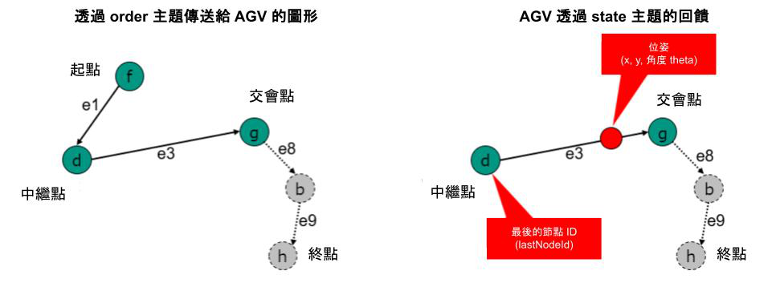
>圖 14 透過狀態主題提供的任務資訊。僅傳輸最後一個節點 ID 以及剩餘的節點與邊。

### 6.10.2 節點的遍歷與進入/離開邊緣、觸發動作

AGV 會自行決定何時將節點視為已經過。
通常情況下，AGV 的控制點應位於節點的 `allowedDeviationXY` 範圍內，且其方向角應在 `allowedDeviationTheta` 範圍內。
如果隨後的邊緣（edge）的屬性 `corridor` 已設置，則應額外滿足這些邊界條件。

當 AGV 已經過該節點時，該節點會從 `nodeStates` 陣列中對應的 `nodeState`被移除，並將 `lastNodeId`、`lastNodeSequenceId` 設置為該節點的值。

當 AGV 報告節點已經過時，若該節點有關聯的動作，則應觸發這些動作。

經過節點的同時，也表示 AGV 離開了連接至該節點的(前一個)邊。
此時，此邊應從 `edgeStates` 中移除，且在此邊上執行中的動作應完成。

此外，經過節點的同時，也代表 AGV 進入了接續的邊（如果有的話）。
此時應觸發應在此邊上執行的動作。
此規則的例外是，若 AGV 需要在此邊暫停（例如此邊緣為軟阻擋或硬阻擋邊，或其他情況），則只有當 AGV 開始再次移動時，才算正式進入邊。

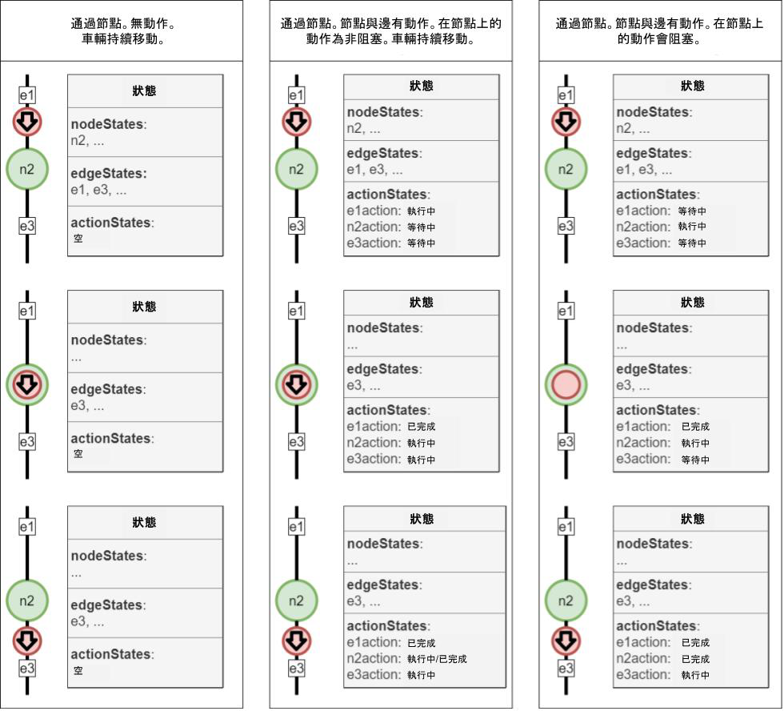
>圖 15 任務處理過程中 `nodeStates`, `edgeStates` 與`actionStates` 的描繪。


### 6.10.3 請求(新的)已確認區段

如果 AGV 偵測到已確認區段(的節點與邊)即將耗盡，則可以將 `newBaseRequest` 標誌設置為 "true"，以防止不必要的剎車動作。

### 6.10.4 資訊

AGV 可以透過 `information` 陣列向中央控制系統提交額外的資訊，內容由 AGV 自行決定。
AGV 也可自行決定此資訊的頻率。

中央控制系統不應將這些資訊用於邏輯判斷，而應僅用於視覺化與除錯目的。


### 6.10.5 錯誤

AGV 透過 `errors` 陣列回報錯誤，錯誤分為警告（'WARNING'）與 嚴重錯誤 （'FATAL'）兩個等級。
警告是可自動恢復的錯誤，例如偏離行駛路徑的警告（Field Violation）。
嚴重錯誤是需要人員介入處理的錯誤。
此外，錯誤訊息可透過 `errorReferences` 陣列傳遞相關資訊，以幫助快速得知錯誤的根本原因。

### 6.10.6 狀態訊息的實作

物件結構 | 單位 | 資料型態 | 描述
---|---|---|---
headerId | | uint32 | 訊息的標頭 ID。<br> 每個主題（topic）定義了自己的 headerId，並且每傳送一次訊息（但不一定會被接收），headerId 會遞增 1。
timestamp | | string | 時間戳記（ISO 8601, UTC），格式為 YYYY-MM-DDTHH:mm:ss.ffZ（例如："2017-04-15T11:40:03.12Z"）。
version | | string | 協定的版本，格式為 [主版本].[次版本].[修正版本]（例如 1.3.2）。
manufacturer | | string | AGV 的製造商名稱。
serialNumber | | string | AGV 的序號。
*maps[map]* | | array | 當前儲存在 AGV 上的地圖物件陣列。
orderId| | string | 當前任務或上一筆完成任務的唯一識別碼。 <br>該 orderId 會保留，直到收到新訂單為止。<br>如果都沒有可用的先前 orderId，則為空字串（""）
orderUpdateId | | uint32 | 任務更新的識別碼，用於確認 AGV 已接受任務更新。<br>如果都沒有可用的先前 orderUpdateId，則為 "0"。
*zoneSetId* | |string | AGV 當前用於路徑規劃的區域集合之唯一 ID。<br>該值應與任務中的區域集合一致。<br><br>可選填欄位：如果 AGV 不使用區域概念，則可以省略此欄位。
lastNodeId | | string | 上次到達的節點 ID，或者如果 AGV 當前停在節點上，則為該節點的 ID（例如："node7"）。如果沒有可用的 `lastNodeId`，則為空字串（""）。
lastNodeSequenceId | | uint32 | 上次到達的節點序列 ID，或者如果 AGV 當前停在節點上，則為該節點的序列 ID。<br>如果沒有可用的 `lastNodeSequenceId`，則為 "0"。
**nodeStates [nodeState]** | |array | 為了完成當前任務，AGV 需要通過的 nodeState 陣列<br>(如果 AGV 處於閒置狀態，則為空陣列）。
**edgeStates [edgeState]** | |array | 為了完成當前任務，AGV 需要通過的 edgeState 陣列<br>（如果 AGV 處於閒置狀態，則為空陣列）。
***agvPosition*** | | JSON object | AGV 在地圖上的當前位姿。<br><br>可選欄位：對於無法自行定位的 AGV（例如：循線導引 AGV），可以省略此欄位。
***velocity*** | | JSON object | AGV 在車輛座標中的速度資訊。
***loads [load]*** | | array | AGV 當前處理的負載列表。<br><br>可選欄位：如果 AGV 無法判斷負載狀態，則應完全省略此欄位，而不是回報為空陣列。 <br>如果 AGV 能夠判斷負載狀態，但陣列為空，則表示 AGV 未載運任何貨物。
driving | | boolean | "true"：AGV 正在行駛或旋轉（不包括舉升等其他動作）。<br>"false"：AGV 目前沒有行駛或旋轉。
*paused* | | boolean | "true"：AGV 當前處於暫停狀態，可能是由於按下了 AGV 上的物理按鈕，或是受到了 instantAction 指令影響。 <br>AGV 可恢復任務執行。<br><br>"false"：AGV 未處於暫停狀態。
*newBaseRequest* | | boolean | "true"：當 AGV 已接近當前已確認區段的終點，如果未接收到新的已確認區段資訊，AGV 將會減速。<br>觸發請求，要求中央控制系統發送新的已確認區段資訊。<br><br>"false"：無需更新已確認區段資訊。
*distanceSinceLastNode* | 公尺 | float64 | 用於循線導引 AGV，標示自上次通過 lastNodeId 以來行駛的距離。 <br>（單位：公尺）
**actionStates [actionState]** | | array | 包含當前任務的動作與自上次任務以來所有收到的 instantActions。這些狀態會一直保留，直到收到新的任務。收到新任務時，除了正在執行的即時動作之外，所有動作的狀態都會被移除。 <br>因此可能會包括在先前節點但仍在進行中的動作。<br><br>當某個動作完成後，actionStatus 會更新為 'FINISHED'，並在適用的情況下提供對應的 resultDescription。
**batteryState** | | JSON object | 包含所有與電池相關的資訊。
operatingMode | | string | 枚舉值 {'AUTOMATIC', 'SEMIAUTOMATIC', 'MANUAL', 'SERVICE', 'TEACHIN'}<br> 詳細資訊請參考 [6.10.6 狀態訊息的實作](#6106-狀態訊息的實作) 的 Table 1。
**errors [error]** | | array | 存放 AGV 的錯誤的陣列。<br>當前影響 AGV 運行的錯誤都應該在陣列中。<br>如果錯誤陣列為空，表示當前沒有影響 AGV 運行的錯誤。
***information [info]*** | | array | 存放資訊物件的陣列。<br>如果陣列為空，則表示 AGV 沒有額外的資訊。 <br>這些資訊僅用於視覺化或除錯，不得用於中央控制系統的邏輯判斷。
**safetyState** | | JSON object | 包含所有與安全性相關的資訊。

物件結構 | 單位 | 資料型態 | 描述
---|---|---|---
**map**{ | | JSON object |
mapId | | string | 地圖的 ID 。 地圖為描繪車輛工作空間區域的界定。
mapVersion | | string | 地圖版本。
*mapDescription* | | string | 地圖的額外資訊。
mapStatus <br>}| | string | 枚舉值 {'ENABLED', 'DISABLED'}<br>'ENABLED'：表示該地圖目前在 AGV 上處於啟用狀態，並被使用。對於相同的 mapId，最多只能有一個地圖處於 'ENABLED' 狀態。<br>'DISABLED'：表示該地圖版本當前未啟用，並且可以根據需求啟用或刪除。

物件結構 | 單位 | 資料型態 | 描述
---|---|---|---
**nodeState** { | JSON object | |
nodeId | | string | 節點的唯一識別碼。
sequenceId | | uint32 | 用於辨別具有相同 nodeId 的多個節點的序列 ID。
*nodeDescription* | | string | 關於該節點的額外資訊。
released| | boolean | "true" 表示該節點屬於已確認區段。<br>"false" 表示該節點屬於預視區段。
***nodePosition***<br><br>}| | JSON object | 節點的位置相關資訊。 <br>詳細定義請參見 [6.6 主題: "order"](#66-主題-order-從中央控制系統到-agv) <br>可選填欄位： <br>若中央控制系統擁有此資訊可以不需要傳送。 <br>此資訊可以以額外資訊傳送(例如為了除錯)。

物件結構 | 單位 | 資料型態 | 描述
---|---|---|---
**edgeState** { | | JSON object | |
edgeId | | string | 邊的唯一識別碼。
sequenceId | | uint32 | 用於辨別具有相同 edgeId 的多個邊的序列 ID。
*edgeDescription* | | string | 關於此邊的額外描述。
released | | boolean | "true" 表示邊屬於已確認區段。<br>"false" 表示邊屬於預視區段。
***trajectory*** <br><br>} | | JSON object | 邊緣的軌跡以 NURBS表示，並定義於 [6.6.6 任務訊息的實作](#666-任務訊息的實作)。<br><br>軌跡段起始於 AGV 進入邊的位置，終止於 AGV 報告已通過終點節點的位置。

物件結構 | 單位 | 資料型態 | 描述
---|---|---|---
**agvPosition** { | | JSON object | 定義 AGV 在地圖上的世界座標位置。每層樓都有獨立的地圖。
positionInitialized | | boolean | "true"：位置已初始化。<br>"false"：位置尚未初始化。
*localizationScore* | | float64 | 範圍：[0.0 ... 1.0]<br><br>描述當前定位的品質，適用於 SLAM AGV。用來描述當前定位的準確度。<br><br>0.0：未知位置<br>1.0：已知位置<br><br>無法估算定位準確度的車輛，此欄位為可選填。<br><br>該欄位僅用於日誌記錄與視覺化目的。
*deviationRange* | m | float64 | 位置偏差範圍（單位：公尺）。<br><br>無法估算位置偏差（例如基於網格定位）的車輛可選填此欄位。<br><br>該欄位僅用於日誌記錄與可視化目的。
x | m | float64 | 地圖座標系統中的 X 座標。<br>精度取決於具體實作。
y | m | float64 | 	地圖座標系統中的 Y 座標。<br>精度取決於具體實作。
theta | | float64 | 範圍：[-Pi ... Pi]<br><br>AGV 的朝向角度。
mapId | | string | AGV 當前引用位置的地圖唯一識別碼。<br><br>每張地圖的原點（座標系統）相同。<br>當 AGV 從出發樓層搭乘電梯前往目的樓層時，它將離開原樓層的地圖，並在目的樓層的電梯節點重新生成位置。
*mapDescription*<br>} | | string | 地圖的額外資訊。

物件結構 | 單位 | 資料型態 | 描述
---|---|---|---
**velocity** { | | JSON object |
*vx* | 公尺/秒 (m/s) | float64 | AGV 沿 X 方向的速度。
*vy* | 公尺/秒 (m/s) | float64 | AGV 沿 Y 方向的速度。
*omega*<br>}| 弧度/秒 (Rad/s) | float64 | AGV 繞 Z 軸的旋轉速度。

物件結構 | 單位 | 資料型態 | 描述
---|---|---|---
**load** { | | JSON object |
*loadId* | | string | 負載的唯一識別碼（例如：條碼或 RFID）。<br><br>如果 AGV 能夠識別負載但尚未識別，則此欄位為空。<br><br>若 AGV 無法識別負載，此欄位為選填。
*loadType* | | string | 負載類型。
*loadPosition* | | string | 指示 AGV 使用的負載處理/承載單元，例如當 AGV 具有多個承載位置時。<br><br>例如："front"、"back"、"positionC1"  ...等。<br><br>若 AGV 只有一個負載位置，則此欄位為選填。
***boundingBoxReference*** | | JSON object | 負載邊界框的位置參考點。 <br>參考點始終位於邊界框底部（高度 = 0）表面的中心，並以 AGV 座標系統中的座標表示。
***loadDimensions*** | | JSON object | 負載邊界框的尺寸（單位: 公尺）。
*weight*<br>} | 公斤 (kg) | float64 | 範圍: [0.0 ... float64.max]<br><br>負載的絕對重量（單位：公斤）。

物件結構 | 單位 | 資料型態 | 描述
---|---|---|---
**boundingBoxReference** { | | JSON object | 負載邊界框的位置參考點。<br>參考點始終位於邊界框底部（高度 = 0）表面的中心，並以 AGV 座標系統中的座標表示。
x | | float64 | 參考點的 X 座標。
y | | float64 | 參考點的 Y 座標。
z | | float 64 | 參考點的 Z 座標。
*theta*<br> } | | float64 | 負載邊界框的方向角。 <br>對於牽引車（tuggers）、列車（trains）...等，此欄位很重要。

物件結構 | 單位 | 資料型態 | 描述
---|---|---|---
**loadDimensions** { | | JSON object | 負載邊界框的尺寸（單位: 公尺）。
length | 公尺 (m) | float64 | 負載邊界框的絕對長度。
width | 公尺 (m) | float64 | 負載邊界框的絕對寬度。
*height* <br>}| 公尺 (m) | float64 | 負載邊界框的絕對高度。<br><br>選填欄位: <br> 僅在知道高度時設定此值。

物件結構 | 單位 | 資料型態 | 描述
---|---|---|---
**actionState** { | | JSON object |
actionId | |string | 動作的唯一識別碼。
*actionType* | | string | 動作類型。<br><br>可選填欄位：僅用於資訊顯示或視覺化目的。中央控制系統在指派任務時就已知動作類型。
*actionDescription* | | string | 目前動作的額外資訊。
actionStatus | | string | 枚舉值 {'WAITING', 'INITIALIZING', 'RUNNING', 'PAUSED', 'FINISHED', 'FAILED'}<br><br>詳見 [6.11 actionStates](#611-actionstates).
*resultDescription*<br>} | | string | 結果描述，例如 RFID 讀取結果。<br><br>錯誤資訊將透過 errors 欄位傳輸。

物件結構 | 單位 | 資料型態 | 描述
---|---|---|---
**batteryState** { | | JSON object | 
batteryCharge | % | float64 | 電池充電狀態：<br> 如果 AGV 只能提供「良好」或「不良」的電量等級，則這些值將分別顯示為 80%（良好）和 20%（不良）。
*batteryVoltage* | 伏特 (V) | float64 | 電池電壓。
*batteryHealth* | % | int8 | 範圍: [0 ... 100]<br><br>數值代表對電池健康的狀況描述。
charging | | boolean | "true"：充電中。<br>"false"：AGV 目前未在充電。
*reach* <br>}| 公尺 (m) | uint32 | 範圍: [0 ... uint32.max]<br><br>根據當前電量估算的可行駛距離（單位：公尺）。

物件結構 | 單位 | 資料型態 | 描述
---|---|---|---
**error** { | | JSON object |
errorType | | string | 錯誤的類型或名稱。
***errorReferences [errorReference]*** | | array | 參考資訊的陣列（例如：nodeId、edgeId、orderId、actionId ...等），提供與錯誤相關的更多資訊。<br>更多資訊請參閱 [7 Best practice](#7-best-practice).
*errorDescription* | | string | 詳細描述錯誤內容及可能的成因。
*errorHint* | | string | 提供處理問題的建議方向或解決該錯誤的提示。
errorLevel <br> }| | string | 枚舉值 {'WARNING', 'FATAL'}<br><br>'WARNING'：AGV 可正常啟動（例如：維護週期到期警告）。<br>'FATAL'：AGV 無法運行，需要使用者介入處理（例如：雷射掃描器被污染）。

物件結構 | 單位 | 資料型態 | 描述
---|---|---|---
**errorReference** { | | JSON object |
referenceKey | | string | 使用的指定參考的類型（例如：nodeId、edgeId、orderId、actionId ...等）。
referenceValue <br>} | | string | 與參考鍵對應的值，例如發生錯誤的節點 ID。

物件結構 | 單位 | 資料型態 | 描述
---|---|---|---
**info** { | | JSON object |
infoType | | string | 資訊的類型或名稱。
*infoReferences [infoReference]* | | array | 參考資訊的陣列。
*infoDescription* | | string | 資訊的描述內容。
infoLevel <br>}| | string | 枚舉值 {'DEBUG', 'INFO'}<br><br>'DEBUG': 用於除錯。<br> 'INFO': 用於視覺化呈現。

物件結構 | 單位 | 資料型態 | 描述
---|---|---|---
**infoReference** { | | JSON object |
referenceKey | | string | 指定參考的類型（例如：headerId、orderId、actionId ...等）。
referenceValue <br>} | | string | 與參考鍵對應的值。

物件結構 | 單位 | 資料型態 | 描述
---|---|---|---
**safetyState** { | | JSON object |
eStop | | string | 枚舉值 {'AUTOACK', 'MANUAL', 'REMOTE', 'NONE'}<br><br>緊急停止（eStop）的確認類型：<br>'AUTOACK'：自動生效的緊急停止，例如因為進入保護領域或緩衝裝置觸發。<br>'MANUAL'：需要在車輛上手動確認的緊急停止。<br>'REMOTE'：需要在遠端設備確認的緊急停止。<br>'NONE'：無緊急停止觸發。
fieldViolation<br>} | | boolean | 保護領域是否被侵犯。<br>"true":保護領域被侵犯。<br>"false":保護領域未被侵犯。

#### 操作模式的描述
以下描述列出了主題 "state" 的操作模式（operatingMode）。

識別碼 | 描述
---|---
AUTOMATIC | AGV 由中央控制系統完全控制。<br>AGV 根據中央控制系統的指令行駛並執行動作。
SEMIAUTOMATIC | AGV 由中央控制系統控制。<br> AGV 根據中央控制系統的指令行駛並執行動作。 <br>行駛速度由 HMI (人機介面) 控制（速度不得超過自動模式的速度）。<br>轉向由自動控制（允許非安全的 HMI）。
MANUAL | 中央控制系統不控制 AGV。 <br>監控系統不向 AGV 發送行駛指令或動作指令。 <br>可透過 HMI 控制 AGV 的轉向、速度和操作裝置。<br>AGV 位置會傳送至中央控制系統。<br>當 AGV 進入或離開此模式時，會立即清除所有指令（需要安全的 HMI）。
SERVICE | 中央控制系統不控制 AGV。 <br>中央控制系統不向 AGV 發送行駛指令或動作指令。 <br>已授權人員可重新配置 AGV。
TEACHIN | 中央控制系統不控制 AGV。 <br>監控系統不向 AGV 發送行駛指令或動作指令。 <br>AGV 目前處於教學模式，例如由中央控制系統進行地圖測繪。

>表 1 操作模式及其含義

## 6.11 動作狀態

當 AGV 接收到一個 `action`（無論是附加在 `node` 、 `edge` 或是透過 `instantAction` 傳遞的），該狀態應該在其 `actionStates` 陣列中，使用 `actionState` 來表示此 `action` 的當前狀態。

在 `actionStates` 中，欄位 `actionStatus` 用於描述該動作當前處於生命週期的哪個階段。

表 2 列出 actionStatus 的枚舉值以及其對應的說明。

actionStatus | 描述
---|---
'WAITING' | AGV 已接收到該動作，但尚未到達執行該動作的節點或尚未進入執行該動作的邊。
'INITIALIZING' | 動作已被觸發，AGV 正在進行準備工作。
'RUNNING' | 動作正在執行中。
'PAUSED' | 動作因從 instantAction 收到暫停或從外部觸發（如 AGV 上的暫停按鈕）而暫停。
'FINISHED' | 動作已完成。 <br>結果將透過 resultDescription 報告。
'FAILED' | 無論何種原因導致動作無法完成。

>表 2 actionStatus 欄位的可接受值

圖 16 提供了 actionStates 的所有可能狀態轉換。

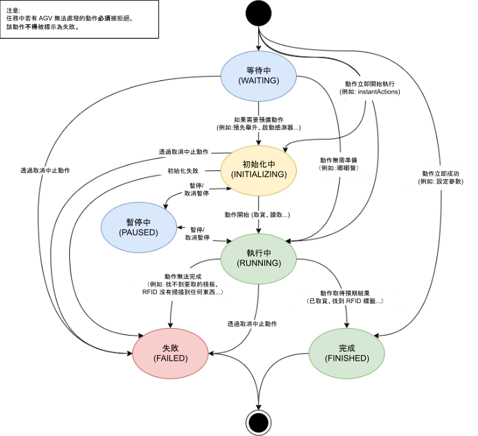
>圖 16 actionStates 的所有可能狀態轉換

## 6.12 動作的阻塞類型與執行順序

當任務中包含多個動作時，其排列順序決定了應執行的先後次序。
動作是否可以並行執行取決於它們的 `blockingType`（阻塞類型）。

阻塞類型共有三種，如表 3 所示：

阻塞類型(blockingType) | 描述
---|---
NONE | 該動作可以與其他動作並行執行，且 AGV 仍可行駛。
SOFT | 該動作可以與其他動作並行執行，但 AGV 不得行駛。
HARD | 該動作不得與其他動作並行執行，且 AGV 不得行駛。

>表 3 動作的阻塞類型

當一個節點上有多個不同阻塞類型的動作時，圖 17 說明了 AGV 如何處理這些動作。

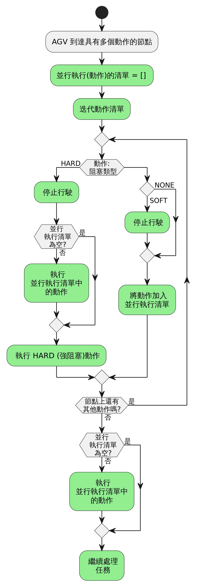
>圖 17 多個動作的處理方式

## 6.13 主題 "visualization"

為了提供接近即時的 AGV 位置更新，AGV 可以透過 `visualization` 主題來廣播其位置與速度資訊。

位置物件的結構與狀態中的位置與速度物件相同。
若需要額外車輛狀態資訊，請參閱  [6.10.6 狀態訊息的實作](#6106-狀態訊息的實作)。
該主題的更新頻率由整合商（integrator）定義。


## 6.14 主題 "connection"

當 AGV 用戶端連接到 MQTT Broker 時，可以設定 遺囑（Last Will） 主題和消息。若 AGV 用戶端與 Broker 斷線，則 Broker 會立即發布該遺囑消息。
中央控制系統可透過訂閱所有 AGV 的 connection 主題來監測 AGV 是否連線。
斷線的偵測方式是心跳機制（Heartbeat），該信號會在 Broker 與 AGV 客戶端 之間定期交換。
大多數 Broker 允許設定心跳間隔，建議設定約 15 秒。
`connection` 主題的 QoS（Quality of Service）等級應設為 1（至少送達一次, At Least Once）。

建議的遺囑主題結構為：

**uagv/v2/manufacturer/SN/connection**

該遺囑訊息為 JSON 格式，包含以下欄位：

識別碼 | 資料型態 | 描述
---|---|---
headerId | uint32 | 訊息的標頭 ID。<br>每個主題都有獨立的 headerId，每次發送時會 遞增 1（但不一定會被成功接收）。
timestamp | string | 時間戳記（ISO 8601 格式, UTC）。格式：YYYY-MM-DDTHH:mm:ss.ffZ（例如 "2017-04-15T11:40:03.12Z"）。
version | string | 協定的版本，格式為 [主版本].[次版本].[修正版本]（例如 1.3.2）。
manufacturer | string | AGV 製造商名稱。
serialNumber | string | AGV 的序號。
connectionState | string | 枚舉值 {'ONLINE', 'OFFLINE', 'CONNECTIONBROKEN'}<br><br>'ONLINE': AGV 與 Broker 之間的連線正常。<br><br>'OFFLINE': AGV 與 Broker 以正常流程中斷連線。 <br><br> 'CONNECTIONBROKEN': AGV 與 broker 的連線非預期情況下中斷。

如果 AGV 使用 MQTT disconnect 命令正常斷線，Broker 不會發送遺囑消息。
只有當連線在非預期情況下中斷 時，Broker 才會發送遺囑消息。

**注意**: 由於 MQTT 的遺囑功能特性，遺囑消息在連線建立時就設定好，因此 timestamp 和 headerId 總是會是舊數據。

AGV 優雅地中斷連線:

1. AGV 發送訊息至 "uagv/v2/manufacturer/SN/connection" ，將 `connectionState` 設為 `OFFLINE`。
2. AGV 執行 MQTT disconnect 命令，與 Broker 正常斷開連線。

AGV 上線:

1. 當 MQTT 連線建立時，設定遺囑訊息至主題 "uagv/v2/manufacturer/SN/connection"，將`connectionState` 設為 `CONNECTIONBROKEN` 。
2. AGV 發送訊息至 "uagv/v2/manufacturer/SN/connection" ，將 `connectionState` 設為 `ONLINE`。

所有此主題(connection)的訊息，應設置為保留 (retained)。

當 AGV 與 broker 的連線非預期中斷時， broker 會發送遺囑訊息至 "uagv/v2/manufacturer/SN/connection" 主題，將 `connectionState` 設為 `CONNECTIONBROKEN`。

## 6.15 主題 "factsheet"

factsheet 提供特定 AGV 機型的基本資訊。
這些資訊可以用來比較不同的 AGV 機型，也可以用在 AGV 系統的規劃、尺寸標注和模擬。
此外，factsheet 也包含 AGV 的通訊介面資訊，這些資訊是讓 AGV 機型可以整合到符合 VDA-5050 標準的中央控制系統時所需的。

有些 factsheet 裡的欄位值只能在系統整合時確定，
例如 專案特定的負載（load）和站點（station）類型，
還有 這台 AGV 支援的站點和負載類型清單。

factsheet 的刻意設計為能給人閱讀的文件，也能交給給機器處理，
例如中央控制系統可以匯入 factsheet，所以格式是 JSON。

中央控制系統可以透過發送 `factsheetRequest` 這個即時動作來請求 AGV 提供 factsheet。

這個主題的所有訊息都應該設為保留訊息（retained）。


### 6.15.1 Factsheet JSON 結構

factsheet 由下表列出的 JSON 物件組成：

| **欄位** | **資料型態** | **描述** |
| --- | --- | --- |
| headerId | uint32 | 訊息的標頭 ID。 <br>每個主題的 headerId 都會定義，並在每次傳送時增加 1（不一定會被接收到）。 |
| timestamp | string | 時間戳記 (ISO 8601, UTC); 格式為 YYYY-MM-DDTHH:mm:ss.ffZ（例如 "2017-04-15T11:40:03.12Z"）。 |
| version | string | 協定的版本 [主版本].[次版本].[修正版本]（例如 1.3.2）。 |
| manufacturer | string | AGV 的製造商。 |
| serialNumber | string | AGV 的序號。 |
| **typeSpecification** | JSON object | 定義 AGV 的類別與能力相關參數。 |
| **physicalParameters** | JSON object | 定義 AGV 的基本物理特性。 |
| **protocolLimits** | JSON object | 定義 MQTT 通訊中，識別碼、陣列、字串等的長度限制。 |
| **protocolFeatures** | JSON object | 定義 AGV 支援的 VDA5050 協定功能。 |
| **agvGeometry** | JSON object | 定義 AGV 的詳細幾何結構。 |
| **loadSpecification** | JSON object | 定義 AGV 的負載能力規格。 |
| ***vehicleConfig*** | JSON object | 總結 AGV 目前的軟硬體版本資訊，以及選填的網路資訊。 |

#### typeSpecification （類型規格）

此 JSON 物件描述 AGV 類型的一般屬性。

| **欄位** | **資料型態** | **描述** |
|---|---|---|
| seriesName | string | 製造商指定的 AGV 系列名稱（格式不限）。 |
| *seriesDescription* | string | AGV 系列的描述(格式不限，供人閱讀) |
| agvKinematic | string | AGV 運動學類型的簡要描述。<br/> [DIFF, OMNI, THREEWHEEL]<br/>DIFF: 差速驅動,<br/>OMNI: 全向移動車輛,<br/>THREEWHEEL: 三輪驅動或類似運動方式的車輛。 |
| agvClass | string | AGV 類別的簡要描述。<br/>[FORKLIFT, CONVEYOR, TUGGER, CARRIER]<br/>FORKLIFT: 堆高機,<br/>CONVEYOR: 具備輸送帶的 AGV,</br>TUGGER: 牽引車,<br/>CARRIER: 具備或不具備升降裝置的載貨 AGV。 |
| maxLoadMass | float64 | [kg] (公斤)，最大可承載質量。 |
| localizationTypes | array of string | 簡要描述定位技術類型。<br/>範例值：<br/>NATURAL: 自然地標,<br/>REFLECTOR: 雷射反射裝置,<br/>RFID: RFID 標籤,<br/>DMC: 二維條碼(QR code),<br/>SPOT: 磁性標記點,<br/>GRID: 磁性網格。<br/>
| navigationTypes | array of string | AGV 支援的路徑規劃類型，依優先順序排列。<br/>範例值：<br/>PHYSICAL_LINE_GUIDED: 無路徑規劃，AGV 依照物理設置的路徑行駛,<br/>VIRTUAL_LINE_GUIDED: AGV 依照固定（虛擬）路徑行駛,<br/>AUTONOMOUS: AGV 能夠自主規劃行駛路徑。

#### physicalParameters（物理參數）

此 JSON 物件描述 AGV 的物理特性。

| **欄位** | **資料型態** | **描述** |
|---|---|---|
| speedMin | float64 | [m/s] (公尺/秒) AGV 可控制的最小連續行駛速度。 |
| speedMax | float64 | [m/s] (公尺/秒) AGV 的最大行駛速度。 |
| *angularSpeedMin* | float64 | [Rad/s] (弧度/秒) AGV 可控制的最小連續旋轉速度。 |
| *angularSpeedMax* | float64 | [Rad/s] (弧度/秒) AGV 的最大旋轉速度。 |
| accelerationMax | float64 | [m/s²] (公尺/秒²) 滿載時的最大加速度。 |
| decelerationMax | float64 | [m/s²] (公尺/秒²) 滿載時的最大減速度。 |
| heightMin | float64 | [m] (公尺) AGV 的最小高度。 |
| heightMax | float64 | [m] (公尺) AGV 的最大高度。  |
| width | float64 | [m] (公尺) AGV 的寬度。 |
| length | float64 | [m] (公尺) AGV 的長度。 |

#### protocolLimits （協議限制）

此 JSON 物件描述 AGV 的通訊協議限制。
如果某個參數未定義或設為零，則表示該參數無明確限制。

| **欄位** | **資料型態** | **描述** |
|---|---|---|
| **maxStringLens** { | JSON object | 各類字串的最大長度限制。 |
| &emsp;*msgLen* | uint32 | MQTT 訊息的最大長度。 |
| &emsp;*topicSerialLen* | uint32 | MQTT 主題中序號部分的最大長度。<br/><br/>影響的參數：<br/>order.serialNumber<br/>instantActions.serialNumber<br/>state.SerialNumber<br/>visualization.serialNumber<br/>connection.serialNumber |
| &emsp;*topicElemLen* | uint32 | MQTT 主題中所有其他部分的最大長度。<br/><br/>影響的參數：<br/>order.timestamp<br/>order.version<br/>order.manufacturer<br/>instantActions.timestamp<br/>instantActions.version<br/>instantActions.manufacturer<br/>state.timestamp<br/>state.version<br/>state.manufacturer<br/>visualization.timestamp<br/>visualization.version<br/>visualization.manufacturer<br/>connection.timestamp<br/>connection.version<br/>connection.manufacturer |
| &emsp;*idLen* | uint32 | ID 字串的最大長度。<br/><br/>影響的參數：<br/>order.orderId<br/>order.zoneSetId<br/>node.nodeId<br/>nodePosition.mapId<br/>action.actionId<br/>edge.edgeId<br/>edge.startNodeId<br/>edge.endNodeId |
| &emsp;*idNumericalOnly* | boolean | 若為 "true"，則 ID 字串只能包含數字。 |
| &emsp;*enumLen* | uint32 | 枚舉與鍵值字串的最大長度。<br/><br/>影響的參數：<br/>action.actionType action.blockingType<br/>edge.direction<br/>actionParameter.key<br/>state.operatingMode<br/>load.loadPosition<br/>load.loadType<br/>actionState.actionStatus<br/>error.errorType<br/>error.errorLevel<br/>errorReference.referenceKey<br/>info.infoType<br/>info.infoLevel<br/>safetyState.eStop<br/>connection.connectionState |
| &emsp;*loadIdLen* | uint32 | loadId 字串的最大長度。 |
| } | | |
| **maxArrayLens** { | JSON object | 各種陣列的最大長度限制。 |
| &emsp;*order.nodes* | uint32 | AGV 可處理的單個任務中的最多節點數量。|
| &emsp;*order.edges* | uint32 | AGV 可處理的單個任務中的最多邊數量。 |
| &emsp;*node.actions* | uint32 | AGV 可處理的單個節點中的最多動作數量。 |
| &emsp;*edge.actions* | uint32 | AGV 可處理的單條邊上的最多動作數量。 |
| &emsp;*actions.actionsParameters* | uint32 | 每個動作可包含的最多參數數量。 |
| &emsp;*instantActions* | uint32 | AGV 可處理單個訊息中最多的即時動作數量。 |
| &emsp;*trajectory.knotVector* | uint32 | 每條軌跡可處理的最多節點（knots）數量。 |
| &emsp;*trajectory.controlPoints* | uint32 | 每條軌跡可處理的最多控制點（control points）的數量。 |
| &emsp;*state.nodeStates* | uint32 | AGV 在 nodeState 訊息中可傳送的最多節點數量，代表 AGV 上最多能處理多少個已確認區段的節點。 |
| &emsp;*state.edgeStates* | uint32 | AGV 在 edgeStates 訊息中可傳送的最多邊的數量，代表 AGV 上最多能處理多少個已確認區段的邊。 |
| &emsp;*state.loads* | uint32 | AGV 可傳送的最大負載數量。 |
| &emsp;*state.actionStates* | uint32 | AGV 可傳送的最多動作狀態（actionStates）數量。 |
| &emsp;*state.errors* | uint32 | AGV 在單一 state 訊息中可傳送的最多錯誤數量。 |
| &emsp;*state.information* | uint32 | AGV 在單一 state 訊息中可傳送的最大資訊數量。 |
| &emsp;*error.errorReferences* | uint32 | AGV 在每個錯誤中可包含的最多錯誤參考數量。 |
| &emsp;*information.infoReferences* | uint32 | AGV 在每個資訊中可包含的最多資訊參考數量。 |
| } | | |
| **timing** { | JSON object | 時間相關資訊。 |
| &emsp;minOrderInterval | float32 | [s]（秒）,發送任務訊息的最小間隔時間。 |
| &emsp;minStateInterval | float32 | [s]（秒）,發送狀態訊息的最小間隔時間。 |
| &emsp;*defaultStateInterval* | float32 | [s]（秒）, 預設的狀態訊息發送間隔，*若未定義，則使用主文件中的預設值*。 |
| &emsp;*visualizationInterval* | float32 | [s]（秒）, 預設的視覺化訊息發送間隔。 |
| } | | |

#### protocolFeatures （協定功能）

此 JSON 物件定義了 AGV 所支援的動作及參數。

| **欄位** | **資料型態** | **描述** |
|---|---|---|
| **optionalParameters** [**optionalParameter**] | array of JSON object | 有支援和(或)必須的選用參數陣列。<br/>未列於此處的選用參數視為 AGV 不支援的參數。 |
| { | | |
| &emsp;parameter | string | 選用參數的完整名稱，例如, "*order.nodes.nodePosition.allowedDeviationTheta"*.|
| &emsp;support | enum | 該選用參數的支援類型，可能的值如下：<br/>'SUPPORTED': 該選用參數有支援，且依照規格實作。<br/>'REQUIRED': 該選用參數為 AGV 正常運作所必須的項目。 |
| &emsp;*description*| string | 針對選用參數的自由格式的文字描述，例如： <ul><li>說明該選用參數為何對此類型的 AGV 是必要的，以及它可以包含哪些值。</li><li>參數 nodeMarker 只能包含無符號整數。</li><li>NURBS 僅支援直線與圓弧段。</li>|
| } | | |
| **agvActions** [**agvAction**] | array of JSON object | AGV 所支援的所有動作（含 VDA5050 指定的標準動作及製造商自定義動作）。 |
| { | | |
| &emsp;actionType | string | 與 action.actionType 對應的唯一動作類型。 |
| &emsp;*actionDescription* | string | 動作的文字描述(自由格式)。 |
| &emsp;actionScopes | array of enum | 此動作類型適用的範圍。可能的值如下：<br/><br/>'INSTANT': 可用作即時動作。<br/>'NODE': 可用於節點上。<br/>'EDGE': 可用於邊上。<br/><br/>例如： ['INSTANT', 'NODE']|
| &emsp;***actionParameters** [**actionParameter**]* | array of JSON object | 該動作所需的參數陣列。<br/>若未定義此欄位，則該動作無需參數。<br/> 這裡定義的 JSON 物件與  [6.6.6 任務訊息的實作](#666-任務訊息的實作) 中 nodes 和 edges 內部的物件不同。|
|&emsp;*{* | | |
|&emsp;&emsp;key | string | 參數的鍵值名稱。 |
|&emsp;&emsp;valueDataType | enum | 值的資料型態，可能的類型為：'BOOL'、'NUMBER'、'INTEGER'、'FLOAT'、'STRING'、'OBJECT'、'ARRAY'。 |
|&emsp;&emsp;*description* | string | 該參數的文字描述(自由格式)。 |
|&emsp;&emsp;*isOptional* | boolean | "true"：此參數為選用。 |
|&emsp;*}* | | |
|*resultDescription* | string | 動作結果的文字描述(自由格式)。 |
|*blockingTypes* | array of enum | 動作可能的阻塞類型。 </br> 枚舉值 {'NONE', 'SOFT', 'HARD'} |
|*}* | | |

### agvGeometry (AGV 幾何資訊)

此 JSON 物件定義了 AGV 的幾何屬性，例如輪廓與輪子的配置。

| **欄位** | **資料型態** | **描述** |
|---|---|---|
| ***wheelDefinitions** [**wheelDefinition**]* | array of JSON object | 包含輪子排列與幾何資訊的陣列。 |
| { | | |
| &emsp;type | enum | 輪子類型<br/> 枚舉值 {'DRIVE', 'CASTER', 'FIXED', 'MECANUM'}。 |
| &emsp;isActiveDriven | boolean | "true"：輪子可主動驅動。 |
| &emsp;isActiveSteered | boolean | "true"：輪子可主動轉向。 |
| &emsp;**position** { | JSON object | |
|&emsp;&emsp; x | float64 | [m] (公尺), AGV 座標系統中的 x 座標位置。 |
|&emsp;&emsp; y | float64 | [m] (公尺), AGV 座標系統中的 y 座標位置。 |
|&emsp;&emsp; *theta* | float64 | [rad] (弧度), 輪子的方向，對於固定輪來說是必要的。 |
| &emsp;} | | |
| &emsp;diameter | float64 | [m] (公尺), 輪子的公稱直徑。 |
| &emsp;width | float64 | [m] (公尺), 輪子的公稱寬度。 |
| &emsp;*centerDisplacement* | float64 | [m] (公尺), 輪子中心相對於旋轉點的位移（對於萬向輪是必須欄位）。<br/> 若未定義此參數，則假定為 0。 |
| &emsp;*constraints* | string | 自由格式的文字，由製造商用來定義約束條件。 |
| } | | |
| ***envelopes2d** [**envelope2d**]* | array of JSON object | AGV 的 2D 外形輪廓，例如空載與負載狀態的機械外形，或不同速度下的安全區域。 |
| { | | |
| &emsp;set | string | 外形輪廓集合的名稱。 |
| &emsp;**polygonPoints** **[polygonPoint]** | array of JSON object | 以 x/y 多邊形表示的外形輪廓，多邊形視為封閉且不得自相交。 |
| &emsp;{ | | |
|&emsp;&emsp; x | float64 | [m] (公尺), 多邊形頂點的 X 座標。 |
|&emsp;&emsp; y | float64 | [m] (公尺), 多邊形頂點的 Y 座標。 |
| &emsp;} | | |
| &emsp;*description* | string | 該外形輪廓集合的文字描述(自由格式)。 |
| *}* | | |
| ***envelopes3d [envelope3d]*** | array of JSON object | AGV 的 3D 外形輪廓(曲線)的陣列。 |
| *{* | | |
| &emsp;set | string | 外形輪廓集合的名稱。 |
| &emsp;format | string |  資料格式，例如 DXF。 |
| &emsp;***data*** | JSON object | 3D 外形輪廓資料，格式依 'format' 定義。 |
| &emsp;*url* | string | 用於下載 3D 外形輪廓的協定與 URL，例如 <ftp://xxx.yyy.com/ac4dgvhoif5tghji>. |
| &emsp;*description* | string | 該外形輪廓集合的文字描述(自由格式)。 |
| *}* | | |

#### loadSpecification （負載規格）

此 JSON 物件定義了 AGV 的負載處理能力及支援的負載類型。

| **欄位** | **資料型態** | **描述** |
|---|---|---|
| *loadPositions* | array of string | 負載位置 / 負載處理裝置的陣列。<br/>此陣列包含了 "state.loads[].loadPosition" 參數及 pick 和 drop 動作的 "lhd" 參數的有效值。<br/>*如果此陣列不存在或為空，則表示 AGV 沒有負載處理裝置。* |
| ***loadSets [loadSet]*** | array of JSON object | AGV 可處理的負載集合陣列。 |
| { | | |
|&emsp; setName | string | 負載集合的唯一名稱，例如 DEFAULT、SET1 ...等。 |
|&emsp; loadType | string | 負載類型，例如 EPAL、XLT1200 ...等。 |
|&emsp; *loadPositions* | array of string | 此負載集合的負載位置（或負載處理裝置）。<br/>*如果此參數不存在或為空，則此負載集合適用於 AGV 上的所有負載處理裝置。* |
|&emsp; ***boundingBoxReference*** | JSON object | 負載邊界框參考，與 state 訊息中的 loads[] 參數一致。 |
|&emsp; ***loadDimensions*** | JSON object | 負載尺寸，與 state 訊息中的 loads[] 參數一致。 |
|&emsp; *maxWeight* | float64 | [kg] (公斤), 此負載類型的最大重量。 |
|&emsp; *minLoadhandlingHeight* | float64 | [m] (公尺), 處理此負載類型與重量時允許的最小高度。<br/>參照 boundingBoxReference。 |
|&emsp; *maxLoadhandlingHeight* | float64 | [m] (公尺), 處理此負載類型與重量時允許的最大高度。<br/>參照 boundingBoxReference。 |
|&emsp; *minLoadhandlingDepth* | float64 | [m] (公尺), 處理此負載類型與重量時允許的最小深度。<br/>參照 boundingBoxReference。 |
|&emsp; *maxLoadhandlingDepth* | float64 | [m] (公尺), 處理此負載類型與重量時允許的最大深度。<br/>參照 boundingBoxReference。 |
|&emsp; *minLoadhandlingTilt* | float64 | [rad] (弧度), 此負載類型與重量允許的最小傾斜角度。 |
|&emsp; *maxLoadhandlingTilt* | float64 | [rad] (弧度), 此負載類型與重量允許的最大傾斜角度。 |
|&emsp; *agvSpeedLimit* | float64 | [m/s] (公尺/秒), 此負載類型與重量允許的最大 AGV 速度。 |
|&emsp; *agvAccelerationLimit* | float64 | [m/s²] (公尺/秒²), 此負載類型與重量允許的最大 AGV 加速度。 |
|&emsp; *agvDecelerationLimit* | float64 | [m/s²] (公尺/秒²), 此負載類型與重量允許的最大 AGV 減速度。 |
|&emsp; *pickTime* | float64 | [s] (秒), 拾取負載的大約花費時間。 |
|&emsp; *dropTime* | float64 | [s] (秒), 放置負載的大約花費時間。 |
|&emsp; *description* | string | 此負載處理集合的描述(自由格式)。 |
| } | | |

#### vehicleConfig (車輛配置)

此 JSON 物件詳細說明了車輛上運行的軟硬體版本，以及網路資訊的簡要總結。

| **欄位** | **資料型態** | **描述** |
|---|---|---|
| *versions[versionInfo]* | array of JSON object | 包含軟硬體資訊的鍵值-資料對陣列。| | { | | |
|&emsp; key | string | 軟體/硬體版本的鍵名（例如 softwareVersion）。 |
|&emsp; value | string | 鍵名對應的版本號（例如 v1.12.4-beta）。 |
| } | | |
| *network* { | JSON object | 車輛的網路連線資訊。此資訊在車輛運行期間不得更新。 |
|&emsp;&emsp; *dnsServers* | array of string | 車輛使用的網域名稱伺服器（DNS）陣列。 |
|&emsp;&emsp; *ntpServers* | array of string | 車輛使用的網路時間協定（NTP）伺服器陣列。 |
|&emsp;&emsp; *localIpAddress* | string | 車輛用於與 MQTT broker 通訊的預先指派 IP 位址。此 IP 位址在運行期間不應修改或變更。 |
|&emsp;&emsp; *netmask* | string | 與本地 IP 位址對應的子網路遮罩。|
|&emsp;&emsp; *defaultGateway* | string | 與本地 IP 位址對應的預設閘道。 |
| &emsp;} | | |

# 7 最佳實踐

本節包含額外資訊，有助於與協定邏輯保持一致的共同理解。

## 7.1 錯誤參考

如果由於錯誤的指令導致錯誤發生，AGV 應在 `errorReferences` 欄位中返回有意義的錯誤參考 (請參見 [6.10.6 狀態訊息的實作](#6106-狀態訊息的實作)).
這可以包括以下資訊：

- `headerId`
- 主題 (`order` or `instantAction`)
- `orderId` 和 `orderUpdateId` （如果錯誤是由指令更新引起）
- `actionId`（如果錯誤是由動作引起）
- (動作)參數清單（如果錯誤是由錯誤的動作參數引起）

如果某個動作因外部因素無法完成（例如：預期位置沒有貨物），應引用 actionId。


## 7.2 參數格式

錯誤、資訊與動作的錯誤參數被設計為包含鍵值對的 JSON 物件陣列。

| **欄位** | **資料型態** | **描述** |
|---|---|---|
**actionParameter** { | JSON object | 針對特定動作的 actionParameter，例如 deviceId (設備 ID)、loadId （負載 ID）、外部觸發器等。
key | string | 參數的鍵名稱。
value</br>} | 以下資料型態之一:</br>array,</br>boolean,</br>number,</br>string,</br>object | 與該鍵對應的值。

以下是動作 "someAction" 的 `actionParameter` 的範例，包含 stationType 和 loadType 的鍵值對：

```
"actionParameters":[
	{"key":"stationType", "value": "floor"},
	{"key":"weight", "value": 8.5},
	{"key": "loadType", "value": "pallet_eu"}
]
```

使用 "key": "actualKey", "value": "actualValue" 這種方式的目的是保持實作的通用性。
"actualValue" 可以是任何可能的 JSON 資料型態，例如浮點數、布林值，甚至是物件。


# 8 詞彙表


## 8.1 定義

概念 | 描述
---|---
自由導航 AGVs<br> (Free navigation AGVs)| 這些車輛使用地圖來規劃自己的路徑。 <br>中央控制系統僅發送起點和終點座標。<br>車輛會將其路徑發送給中央控制系統。<br>當與中央控制系統的連線中斷時，車輛仍能夠繼續行駛。<br>自由導航車輛可以被允許繞過本地障礙物。<br>車輛本身也可能會對接收/配送位置進行微調。
導引式車輛（實體或虛擬）<br>(Guided vehicles (physical or virtual)) |這些車輛的路徑由中央控制系統發送。 <br>路徑計算在中央控制系統內進行。<br>當與中央控制系統的連線中斷時，車輛將完成當前釋放的節點和邊（即「已確認區段」），然後停止。<br>導引式車輛可以被允許繞過本地障礙物。<br>車輛本身也可能會對接收/配送位置進行微調。
中央地圖 （Central map） | 地圖將由中央控制系統集中保存。<br> 此地圖最初被創建，然後持續使用。